# Addendum al Documento Maestro — Sistema Veterinaria "Leo" v1.1

**Tipo:** Entrega incremental sobre el Documento Maestro v1.0. Contiene **únicamente** casos de uso nuevos, casos de uso modificados (versión completa actualizada), el Diagrama UML actualizado, el Prompt para Figma Make actualizado y el Apéndice DDL PostgreSQL. Todo lo no incluido aquí permanece sin cambios respecto de v1.0.

---

## Actualizaciones transversales (reemplazan secciones 0.3 y 0.5 parcialmente)

### Contrato de Respuesta API — Envelope Estándar Obligatorio (reemplaza el `ApiResponse<T>` de §0.3)

Todos los endpoints responden con esta estructura exacta, sin variaciones.

**Éxito (2XX):**

```json
{
  "success": true,
  "data": "<T>",
  "meta": { "page": 1, "limit": 20, "total": 150 }
}
```

`meta` solo se incluye en listados paginados (`?page=1&limit=20`).

**Error (4XX/5XX):**

```json
{
  "success": false,
  "error": {
    "code": "CODIGO_ERROR_SNAKE_UPPER",
    "message": "Mensaje legible",
    "statusCode": 422,
    "details": []
  }
}
```

`details` es opcional (errores de validación Zod: array `{ field, message }`). Los códigos viven en un **enum central** `ErrorCode` (Hono.js, compartido por todos los servicios). Códigos vigentes de v1.0 que se conservan: `SAME_OWNER`, `PET_DECEASED`, `PAST_DATE`, `SLOT_TAKEN`, `DUPLICATE_APPOINTMENT`, `APPOINTMENT_LOCKED`, `INVALID_TRANSITION`, `STAY_OVERLAP`, `STAY_LOCKED`, `EMPTY_HISTORY`, `MODULE_NOT_LICENSED`. Códigos nuevos en v1.1: `TENANT_NOT_FOUND`, `TENANT_DUPLICATE_TAXID`, `MODULE_UNKNOWN`, `SERVICE_NOT_FOUND`, `SERVICE_IN_USE`, `CONFIG_NOT_FOUND`, `CUPO_GUARDERIA_AGOTADO` (reemplaza a `CAPACITY_EXCEEDED`), `MASCOTA_NOT_FOUND`, `TURNO_SOLAPADO` (alias semántico de `SLOT_TAKEN` en validación por duración de servicio), `VACCINE_TYPE_NOT_FOUND`, `VACCINE_PLAN_ALREADY_APPLIED`, `EUTHANASIA_CONFIRMATION_REQUIRED`, `VALIDATION_ERROR`, `INTERNAL_ERROR`.

**Stack de implementación:** Controlador Hono.js valida con Zod (`schema.safeParse`) → llama al Servicio → captura excepciones tipadas (`DomainError(code, statusCode, message, details?)`) → serializa el envelope. El `tenant_id` se extrae **siempre** del JWT (`app_metadata.tenant_id` de Supabase Auth) por un middleware `tenantContext`; nunca viaja en body ni query params. Errores 5XX no controlados se reportan a **Sentry** (backend) antes de responder `INTERNAL_ERROR`.

### Estrategia de Datos Iniciales (Seeders) — Tres niveles

| Nivel | Responsable | Contenido | Cómo se carga |
| :---- | :---- | :---- | :---- |
| **1 — Global** | Super Admin (al desplegar) | Especies, Razas base, Tipos de vacuna estándar, catálogo de Permisos | `seed_global.sql` (ver Apéndice DDL). Tablas **sin** `tenant_id`. |
| **2 — Por Tenant** | Sistema (automático al crear tenant) | Roles base (Admin, Veterinario, Recepcionista) con permisos, `ConfiguracionTenant` con defaults (`cupoMaximoDiario=10`, `diasAvisoVacuna=7`), módulos contratados según plan | Función SQL `on_tenant_created(tenant_id)` invocada por `TenantService.crearTenant()` |
| **3 — Por Admin de Clínica** | Admin del tenant vía UI | Servicios, Profesionales, Horarios de atención, ajustes de configuración | Casos de uso de gestión (Gestión de Servicios, Horarios, Configuración de la Clínica) |

Cada caso de uso que depende de catálogos indica su nivel en la sección A.

---

# 7. Módulo Super Admin *(NUEVO)*

**Rol en el SaaS:** plano de control de la plataforma, **fuera del contexto de cualquier tenant**. Gestiona el ciclo de vida de las clínicas (tenants), sus planes y los módulos vendibles habilitados. Sus endpoints viven bajo `/api/v1/admin/*`, requieren el claim `role=super_admin` en el JWT y **no** aplican filtro `tenant_id` (las políticas RLS de estas tablas autorizan por rol de plataforma). Toda decisión de licenciamiento tomada aquí es verificada en runtime por el middleware `requireModule()` en cada request de los módulos vendibles (RN-G2).

---

## Caso de Uso: Crear / Gestionar Tenant

### A. Requisitos Funcionales y No Funcionales

**Funcionales**

- Dar de alta una clínica veterinaria (tenant) con: nombre, CUIT/RUT, email de contacto y plan contratado (`basico` | `profesional` | `premium`).
- Al crear el tenant, ejecutar automáticamente el **seeder de Nivel 2**: roles base (Admin, Veterinario, Recepcionista), `ConfiguracionTenant` con valores default y módulos contratados según el plan.
- Crear el primer usuario Admin del tenant (invitación por email vía Supabase Auth, con `tenant_id` y rol en `app_metadata`).
- Listar, buscar y filtrar tenants (por nombre, CUIT/RUT, plan, estado); editar datos comerciales; suspender/reactivar un tenant (baja lógica `activo=false`).

**No Funcionales**

- **RN-SA1 (unicidad fiscal):** el CUIT/RUT es único en la plataforma → `409 TENANT_DUPLICATE_TAXID`.
- **RN-SA2 (aprovisionamiento atómico):** alta de tenant + seeder Nivel 2 + invitación del Admin se ejecutan en **una sola transacción**; si algo falla, no queda un tenant a medio provisionar.
- **RN-SA3 (suspensión efectiva):** un tenant suspendido recibe `403 MODULE_NOT_LICENSED` en todos los módulos; sus usuarios pueden autenticarse pero solo ven una pantalla de aviso.
- **RN-SA4 (aislamiento):** los endpoints de Super Admin nunca exponen datos de negocio internos de un tenant (clientes, mascotas), solo metadatos comerciales y de uso.
- **RN-SA5 (auditoría de plataforma):** `CREATE`/`UPDATE` en módulo de auditoría `platform`, registrando el super admin responsable.
- **Validación Zod:** `nombre` (string 3–120), `cuitRut` (regex `^[0-9.\-]{8,15}$`), `emailContacto` (email), `plan` (enum). Errores → `422 VALIDATION_ERROR` con `details`.
- **UX/UI:** tabla de tenants con badges de plan y estado, búsqueda con debounce, drawer lateral de alta/edición, modal `AlertDialog` para suspender. Estados vacío/cargando/error.
- **Rendimiento:** listado paginado e indexado por `nombre` y `cuit_rut`.

### B. Ficha de Caso de Uso

- **Actor principal:** Super Admin de la plataforma (claim `super_admin`).
- **Actor secundario:** Supabase Auth (invitación del Admin del tenant); función `on_tenant_created()`; Auditoría de plataforma.
- **Disparador:** botón *Nuevo Tenant* en la consola Super Admin, o *Editar*/*Suspender* sobre una fila.
- **Precondiciones:** sesión válida con rol de plataforma `super_admin`.

**Flujo normal (alta — mínimos clics)**

1. El Super Admin pulsa *Nuevo Tenant* y completa nombre, CUIT/RUT, email de contacto y plan en un único formulario.
2. Pulsa *Crear*.
3. El backend valida (Zod + RN-SA1) y abre transacción: inserta el `Tenant`, ejecuta `on_tenant_created(tenant_id)` (roles base + configuración default + módulos del plan) e invita al Admin por email.
4. Commit, auditoría de plataforma, *toast* de éxito; el tenant aparece en la tabla con estado *Activo*.

**Flujos alternativos y excepciones**

- **2a.** CUIT/RUT ya registrado → `409 TENANT_DUPLICATE_TAXID`, error inline.
- **2b.** Datos inválidos → `422 VALIDATION_ERROR` con `details` por campo.
- **3a.** Falla el seeder o la invitación → rollback total (RN-SA2); el error con stack trace se reporta a **Sentry** con tag `module=super_admin`, y el usuario recibe `500 INTERNAL_ERROR` con mensaje genérico y `eventId` de Sentry para soporte.
- **Suspender:** modal de confirmación destructiva → `activo=false`; los usuarios del tenant quedan bloqueados (RN-SA3).

### C. Métodos y Gestores — Backend API REST + MVC

**Endpoints:**

| Acción | Ruta |
| :---- | :---- |
| Listar/buscar | `GET /api/v1/admin/tenants?search=&plan=&estado=&page=1&limit=20` |
| Detalle | `GET /api/v1/admin/tenants/{id}` |
| Crear | `POST /api/v1/admin/tenants` |
| Editar | `PUT /api/v1/admin/tenants/{id}` |
| Suspender/Reactivar | `PATCH /api/v1/admin/tenants/{id}/estado` |

**Controlador:** `TenantController` → `listar()`, `obtener()`, `crear()`, `actualizar()`, `cambiarEstado()`.

**Servicio:** `TenantService` → `crearTenant(dto)` *(RN-SA1, RN-SA2; invoca `on_tenant_created` y `AuthService.invitarAdmin`)*, `actualizarTenant(id, dto)`, `cambiarEstado(id, activo)` *(RN-SA3)*, `buscarPaginado(filtros)`.

**Zod Schema (Request Body — crear):**

```ts
const crearTenantSchema = z.object({
  nombre: z.string().min(3).max(120),
  cuitRut: z.string().regex(/^[0-9.\-]{8,15}$/),
  emailContacto: z.string().email(),
  plan: z.enum(["basico", "profesional", "premium"]),
  adminEmail: z.string().email()   // primer usuario Admin invitado
});
```

**DTO Respuesta (dentro del envelope estándar):**

```json
{
  "success": true,
  "data": {
    "id": "uuid",
    "nombre": "Veterinaria San Roque",
    "cuitRut": "30-71234567-8",
    "emailContacto": "contacto@sanroque.vet",
    "plan": "profesional",
    "activo": true,
    "modulosHabilitados": ["historial_clinico", "turnos"],
    "createdAt": "2026-06-09T12:00:00Z"
  }
}
```

---

## Caso de Uso: Gestionar Módulos Contratados

### A. Requisitos Funcionales y No Funcionales

**Funcionales**

- Habilitar o deshabilitar por tenant cada módulo vendible: **Historial Clínico**, **Turnos**, **Guardería** (toggle por módulo).
- Reflejar el cambio **en runtime**: el backend verifica el licenciamiento en cada request mediante el middleware `requireModule()`; la UI del tenant oculta los módulos no contratados (RN-G2).
- Consultar el estado de módulos de un tenant (consola Super Admin) y exponer al frontend del tenant un endpoint de "módulos habilitados" para construir el sidebar.

**No Funcionales**

- **RN-SM1 (verificación por request — middleware):** todo endpoint de un módulo vendible pasa por `requireModule('historial_clinico' | 'turnos' | 'guarderia')`, que resuelve el `tenant_id` del JWT, consulta `ModuloContratado` (con caché en memoria de 60 s por tenant) y rechaza con `403 MODULE_NOT_LICENSED` si está deshabilitado.
- **RN-SM2 (dependencias):** deshabilitar un módulo no borra datos; solo bloquea acceso. La dependencia RN-G1 se respeta: Turnos exige Horarios (transversal, siempre incluido).
- **RN-SM3 (vigencia inmediata):** el cambio invalida la caché del middleware para ese tenant (publicación de evento interno) → efecto ≤ 60 s garantizado, inmediato en condiciones normales.
- **RN-SM4 (auditoría):** cada toggle registra `UPDATE` en módulo `platform` con valores previos/nuevos.
- **Validación Zod:** `modulo` ∈ enum `ModuloVendible`; `habilitado` boolean. Módulo desconocido → `422 MODULE_UNKNOWN`.
- **UX/UI:** en la tabla de tenants, columna con tres `Switch` (Radix) etiquetados HC / TU / GU; confirmación `AlertDialog` solo al **deshabilitar** (acción restrictiva).

### B. Ficha de Caso de Uso

- **Actor principal:** Super Admin.
- **Actor secundario:** Middleware `requireModule()` (consumidor de la configuración); Auditoría de plataforma.
- **Disparador:** toggle de un módulo en la fila del tenant.
- **Precondiciones:** tenant existente y activo.

**Flujo normal**

1. El Super Admin acciona el switch del módulo (p. ej. habilitar Guardería).
2. El backend hace upsert de `ModuloContratado(tenant_id, modulo, habilitado)`, invalida caché (RN-SM3) y audita.
3. *Toast* de éxito; el switch refleja el nuevo estado. Los usuarios del tenant ven (u ocultan) el módulo en su próximo render del sidebar.

**Flujos alternativos y excepciones**

- **1a.** Deshabilitación → modal de confirmación con advertencia "los usuarios perderán acceso inmediato; los datos se conservan".
- **2a.** Tenant inexistente/suspendido → `404 TENANT_NOT_FOUND` / `403`.
- **2b.** Falla de persistencia o de invalidación de caché → rollback, reporte a **Sentry** (`module=super_admin`, contexto `tenantId`, `modulo`), respuesta `500 INTERNAL_ERROR`; el switch revierte en UI con *toast* de error.

### C. Métodos y Gestores — Backend API REST + MVC

**Endpoints:**

| Acción | Ruta |
| :---- | :---- |
| Estado de módulos (consola) | `GET /api/v1/admin/tenants/{id}/modulos` |
| Toggle de módulo | `PUT /api/v1/admin/tenants/{id}/modulos/{modulo}` |
| Módulos habilitados (frontend del tenant) | `GET /api/v1/modulos-habilitados` *(tenant del JWT)* |

**Controlador:** `ModuloContratadoController` → `listarPorTenant()`, `actualizar()`, `habilitadosDelTenant()`.

**Servicio:** `ModuloContratadoService` → `setModulo(tenantId, modulo, habilitado)` *(RN-SM1..SM4)*, `modulosHabilitados(tenantId)` *(con caché)*; consumido por el middleware `requireModule(modulo)`.

**Zod Schema (Request Body):**

```ts
const toggleModuloSchema = z.object({
  habilitado: z.boolean()
});
// path param: modulo ∈ z.enum(["historial_clinico", "turnos", "guarderia"])
```

**DTO Respuesta (dentro del envelope estándar):**

```json
{
  "success": true,
  "data": {
    "tenantId": "uuid",
    "modulos": [
      { "modulo": "historial_clinico", "habilitado": true,  "fechaAlta": "2026-01-10" },
      { "modulo": "turnos",            "habilitado": true,  "fechaAlta": "2026-01-10" },
      { "modulo": "guarderia",         "habilitado": false, "fechaAlta": null }
    ]
  }
}
```

---
# 2. Módulos Transversales *(ampliación: nuevos submódulos 2.4 y 2.5)*

**Rol en el SaaS:** servicios compartidos por todos los módulos vendibles dentro de cada tenant. Se agregan **Gestión de Servicios** (catálogo parametrizable que alimenta Turnos e Historial) y **Configuración de la Clínica** (parámetros operativos del tenant que alimentan las validaciones de Guardería e Historial Clínico).

---

## 2.3 bis Horarios de Atención — *acceso (redefine RN-HOR5)*

- **RN-HOR7 (gestión del horario propio):** el profesional con `manage_schedules` gestiona **únicamente las franjas de su propio perfil `Doctor`** (`doctores.user_id` = usuario del JWT); sobre el de otro obtiene `403 FORBIDDEN`. Quien administra la clínica (`manage_users`) gestiona el de cualquiera. **La lectura no se restringe**: ver la agenda del resto del equipo es parte de coordinarse, y el módulo Turnos la consume para ofrecer slots. Esto **redefine RN-HOR5** de la v1.0 ("gestión restringida a Administrador"), que dejaba inutilizable el permiso `manage_schedules` que el seeder ya otorgaba al rol veterinario.
- **Corolario de acceso (lectura de profesionales):** el listado de profesionales (`GET /doctores`) es un dato de apoyo de Horarios, Turnos, Historial Clínico y Vacunación —todos eligen un profesional de una lista—, así que su **lectura** requiere cualquiera de `manage_users`, `manage_schedules`, `manage_appointments`, `manage_medical_history` o `view_medical_history`. Su **gestión** (alta/edición del perfil profesional) sigue restringida a `manage_users` (RN-SEC5).
- **Matriz de permisos por rol (seeder Nivel 2):** el rol **Veterinario** incluye `manage_clients`, consistente con las fichas de caso de uso del Documento Maestro que lo listan como actor de la gestión de clientes. Roles base: Administrador (todos), Veterinario (`manage_clients`, `manage_pets`, `view_medical_history`, `manage_medical_history`, `manage_appointments`, `manage_schedules`), Recepcionista (`manage_clients`, `manage_pets`, `view_medical_history`, `manage_appointments`, `manage_daycare`).

---

## 2.4 Submódulo: Gestión de Servicios *(NUEVO)*

### Caso de Uso: Gestión de Servicios

#### A. Requisitos Funcionales y No Funcionales

**Funcionales**

- CRUD de servicios del tenant: `nombre`, `duracionMinutos`, `requiereProfesional`, `tipo` (`clinica` | `peluqueria` | `guarderia` | `cirugia` | `otro`), `activo`.
- Listar, buscar y filtrar por tipo y estado; activar/desactivar (baja lógica).
- Exponer los servicios activos al módulo Turnos: al agendar, el Combobox de Servicio **auto-popula la duración del slot** (`endTime = startTime + duracionMinutos`) y **bloquea el selector de hora fin** (ver Caso de Uso "Agendar Turno" actualizado).
- **Nivel de seeder: 3 (Por Admin de Clínica).** El tenant nace sin servicios; el Admin los crea desde esta pantalla.

**No Funcionales**

- **RN-SV1 (duración válida):** `duracionMinutos` entero entre 5 y 480, múltiplo de 5 → si no, `422 VALIDATION_ERROR`.
- **RN-SV2 (nombre único por tenant):** no se admiten dos servicios activos con el mismo nombre en el tenant → `409 SERVICE_IN_USE` (constraint `UNIQUE(tenant_id, lower(nombre))`).
- **RN-SV3 (baja lógica protegida):** un servicio referenciado por turnos futuros no se desactiva sin confirmación; al desactivar, deja de ofrecerse en el Combobox pero los turnos existentes conservan la referencia.
- **RN-SV4 (requiereProfesional):** si `true`, Agendar Turno exige seleccionar Doctor; si `false`, el campo Doctor es opcional.
- **RN-SV5 (tenant del JWT):** `tenant_id` se asigna server-side desde el JWT; RLS garantiza aislamiento.
- **RN-SV6 (permiso):** requiere `manage_services` (incluido en rol Admin del seeder Nivel 2).
- **RN-SV7 (auditoría):** `CREATE`/`UPDATE`/`DELETE` en módulo `services`.
- **UX/UI:** tabla CRUD con columnas Nombre, Tipo (badge por color), Duración (chip "30 min"), Requiere profesional (ícono), Estado; drawer de alta/edición; paginación estándar.
- **Rendimiento:** índice `(tenant_id, activo)`; el Combobox de Turnos consume `GET /servicios?activo=true` cacheado en el cliente (SWR).

#### B. Ficha de Caso de Uso

- **Actor principal:** Administrador del tenant (`manage_services`).
- **Actor secundario:** Módulo Turnos (consumidor); Auditoría.
- **Disparador:** menú *Configuración → Servicios*, botón *Nuevo Servicio* o *Editar*.
- **Precondiciones:** sesión válida; permiso `manage_services`.

**Flujo normal (alta — mínimos clics)**

1. El Admin pulsa *Nuevo Servicio* y completa nombre, tipo, duración (slider/stepper de 5 en 5) y el switch *Requiere profesional*.
2. Pulsa *Guardar*.
3. El backend valida (Zod + RN-SV1, RN-SV2), persiste con el `tenant_id` del JWT, audita y muestra *toast*.
4. El servicio queda disponible de inmediato en el Combobox de Agendar Turno.

**Flujos alternativos y excepciones**

- **2a.** Nombre duplicado → `409 SERVICE_IN_USE`, error inline.
- **2b.** Duración fuera de rango → `422 VALIDATION_ERROR` con `details`.
- **Desactivar:** si hay turnos futuros que lo referencian, modal de advertencia (RN-SV3); al confirmar se desactiva.
- **Fallo de sistema:** excepción no controlada → captura por el error handler de Hono, reporte a **Sentry** (`module=services`, `tenantId`), respuesta `500 INTERNAL_ERROR`; la UI muestra estado de error con botón *Reintentar*.

#### C. Métodos y Gestores — Backend API REST + MVC

**Endpoints:**

| Acción | Ruta |
| :---- | :---- |
| Listar/buscar | `GET /api/v1/servicios?search=&tipo=&activo=&page=1&limit=20` |
| Detalle | `GET /api/v1/servicios/{id}` |
| Crear | `POST /api/v1/servicios` |
| Editar | `PUT /api/v1/servicios/{id}` |
| Activar/Desactivar | `PATCH /api/v1/servicios/{id}/estado` |

**Controlador:** `ServicioController` → `listar()`, `obtener()`, `crear()`, `actualizar()`, `cambiarEstado()`.

**Servicio:** `ServicioService` → `crearServicio(dto)` *(RN-SV1, RN-SV2)*, `actualizarServicio(id, dto)`, `cambiarEstado(id, activo)` *(RN-SV3)*, `listarActivos(tenantId)` *(consumido por TurnoService)*.

**Zod Schema (Request Body):**

```ts
const servicioSchema = z.object({
  nombre: z.string().min(3).max(80),
  tipo: z.enum(["clinica", "peluqueria", "guarderia", "cirugia", "otro"]),
  duracionMinutos: z.number().int().min(5).max(480).multipleOf(5),
  requiereProfesional: z.boolean(),
  descripcion: z.string().max(300).optional()
});
```

**DTO Respuesta (dentro del envelope estándar):**

```json
{
  "success": true,
  "data": {
    "id": "uuid",
    "nombre": "Baño y Corte",
    "tipo": "peluqueria",
    "duracionMinutos": 60,
    "requiereProfesional": false,
    "descripcion": "Incluye secado",
    "activo": true,
    "createdAt": "2026-06-09T12:00:00Z"
  }
}
```

---

## 2.5 Submódulo: Configuración de la Clínica *(NUEVO)*

### Caso de Uso: Configuración de la Clínica

#### A. Requisitos Funcionales y No Funcionales

**Funcionales**

- Permitir al Admin del tenant consultar y editar los parámetros operativos:
  - `cupoMaximoDiario`: capacidad máxima de mascotas simultáneas por día en Guardería.
  - `diasAvisoVacuna`: días de anticipación con que se notifica al cliente el vencimiento de una vacuna (consumido por el Plan de Vacunación, req. 7c).
  - `parametrosExtra` (JSON): otros parámetros operativos futuros (p. ej. horas de antelación de recordatorio de turnos).
- Alimentar **directamente** las validaciones de negocio: `EstadiaService` lee `cupoMaximoDiario` (RN-GU4 actualizada) y `PlanVacunacionService`/`NotificacionService` leen `diasAvisoVacuna`.
- **Nivel de seeder: 2 (Por Tenant).** El registro se crea con valores default (`cupoMaximoDiario=10`, `diasAvisoVacuna=7`) por `on_tenant_created()`; luego es editable por el Admin (Nivel 3).

**No Funcionales**

- **RN-CF1 (registro único):** existe exactamente una fila de `ConfiguracionTenant` por tenant (`UNIQUE(tenant_id)`); el endpoint hace siempre `GET`/`PUT` del singleton, nunca `POST`.
- **RN-CF2 (rangos):** `cupoMaximoDiario` entero 1–500; `diasAvisoVacuna` entero 1–90 → fuera de rango `422 VALIDATION_ERROR`.
- **RN-CF3 (efecto inmediato):** los servicios consumidores leen la configuración en cada validación (sin caché de larga vida); reducir el cupo no cancela estadías ya reservadas, solo bloquea nuevas altas que excedan.
- **RN-CF4 (permiso):** requiere `manage_tenant_settings` (rol Admin).
- **RN-CF5 (auditoría):** `UPDATE` en módulo `system` con valores previos/nuevos.
- **UX/UI:** panel de ajustes con secciones (Guardería, Notificaciones), inputs numéricos con stepper y texto de ayuda explicando el efecto de cada parámetro; botón *Guardar cambios* habilitado solo si hay modificaciones (dirty state).

#### B. Ficha de Caso de Uso

- **Actor principal:** Administrador del tenant (`manage_tenant_settings`).
- **Actor secundario:** `EstadiaService` y `PlanVacunacionService` (consumidores); Auditoría.
- **Disparador:** menú *Configuración → Clínica*.
- **Precondiciones:** tenant aprovisionado (la fila existe por seeder Nivel 2).

**Flujo normal**

1. El Admin abre el panel; el sistema precarga la configuración vigente.
2. Modifica `cupoMaximoDiario` y/o `diasAvisoVacuna`.
3. Pulsa *Guardar cambios*.
4. El backend valida rangos (RN-CF2), persiste, audita y muestra *toast*. Las próximas validaciones de Guardería y los próximos avisos de vacunas usan los nuevos valores (RN-CF3).

**Flujos alternativos y excepciones**

- **3a.** Valor fuera de rango → `422 VALIDATION_ERROR` con `details`, error inline bajo el campo.
- **1a.** Fila de configuración ausente (tenant corrupto) → `404 CONFIG_NOT_FOUND`; el incidente se reporta a **Sentry** con severidad `error` (`module=system`, `tenantId`) porque implica fallo del seeder Nivel 2; la UI muestra estado de error con contacto a soporte.

#### C. Métodos y Gestores — Backend API REST + MVC

**Endpoints:**

| Acción | Ruta |
| :---- | :---- |
| Obtener configuración | `GET /api/v1/configuracion` |
| Actualizar configuración | `PUT /api/v1/configuracion` |

**Controlador:** `ConfiguracionTenantController` → `obtener()`, `actualizar()`.

**Servicio:** `ConfiguracionTenantService` → `obtener(tenantId)` *(RN-CF1)*, `actualizar(tenantId, dto)` *(RN-CF2, RN-CF5)*, `valor(tenantId, clave)` *(API interna para EstadiaService / PlanVacunacionService)*.

**Zod Schema (Request Body):**

```ts
const configuracionSchema = z.object({
  cupoMaximoDiario: z.number().int().min(1).max(500),
  diasAvisoVacuna: z.number().int().min(1).max(90),
  parametrosExtra: z.record(z.string(), z.unknown()).optional()
});
```

**DTO Respuesta (dentro del envelope estándar):**

```json
{
  "success": true,
  "data": {
    "cupoMaximoDiario": 15,
    "diasAvisoVacuna": 10,
    "parametrosExtra": {},
    "updatedAt": "2026-06-09T12:00:00Z"
  }
}
```

---

# 1. Módulo Core Cliente-Mascota *(caso de uso modificado)*

**Rol en el SaaS:** sin cambios (nexo de los módulos vendibles). Se actualiza el caso de uso de Mascota para incorporar `tamano` y `alimentoDieta` (req. 4), consumidos por la ficha de mascota y por Guardería.

---

## Caso de Uso: Registrar / Editar Mascota *(versión actualizada)*

### A. Requisitos Funcionales y No Funcionales

**Funcionales**

- Dar de alta una mascota con: nombre, cliente asociado, especie, raza (opcional), sexo, **tamaño** (obligatorio: `Pequeño` | `Mediano` | `Grande`), fecha de nacimiento, color/observaciones y **alimento/dieta** (texto libre: dieta o alimento especial).
- Calcular y mostrar la **edad** automáticamente a partir de la fecha de nacimiento.
- Editar la mascota; listar y buscar por nombre, especie, raza o dueño. Filtros avanzados por especie, estado (activa/fallecida), tamaño y rango etario.
- Mostrar `tamano` y `alimentoDieta` en la **ficha de la mascota** y exponerlos al **módulo Guardería** al registrar una estadía (para que el personal sepa qué darle de comer).
- Exportar a Excel y PDF.
- **Nivel de seeder (catálogos):** Especies y Razas provienen del catálogo **global (Nivel 1)**, compartido por todos los tenants (sin `tenant_id`).

**No Funcionales**

- **RN-MA1 (obligatorios):** nombre, cliente, especie, sexo y **tamaño** son obligatorios; raza, fecha de nacimiento, observaciones y alimento/dieta opcionales.
- **RN-MA2 (taxonomía):** la raza debe pertenecer a la especie seleccionada; el select de raza se deshabilita hasta elegir especie.
- **RN-MA3 (peso fuera de Mascota):** el peso NO es atributo de Mascota; se registra por consulta en el Historial Clínico. La ficha muestra el último peso como dato derivado.
- **RN-MA4 (fecha de nacimiento inmutable):** una vez creada, no es editable.
- **RN-MA5 (edad derivada):** se calcula en tiempo real y no se persiste.
- **RN-MA6 (baja lógica):** eliminar marca `deleted=true`.
- **RN-MA7 (auditoría):** `CREATE`/`UPDATE` en módulo `pets`.
- **RN-MA8 (tamaño tipado — NUEVO):** `tamano` es ENUM PostgreSQL `tamano_mascota` con valores exactos `Pequeño | Mediano | Grande`; cualquier otro valor → `422 VALIDATION_ERROR`.
- **RN-MA9 (dieta visible en Guardería — NUEVO):** `alimentoDieta` (TEXT, máx. 500 caracteres) se muestra de forma destacada en la ficha y en el formulario de Registrar Estadía; si está vacío, Guardería muestra "Sin indicaciones de dieta".
- **RN-MA10 (estado de mascota):** el estado vital se modela como ENUM `estado_mascota` (`Activa` | `Fallecida`); reemplaza al booleano `deceased` de v1.0 y es actualizado automáticamente por la regla de Eutanasia (ver Historial Clínico).
- **Validación Zod:** ver sección C. **UX:** selects encadenados Cliente→Mascota y Especie→Raza; `tamano` como segmented control de 3 opciones; `alimentoDieta` como textarea con contador (500); aviso de que el peso vive en el Historial Clínico.

### B. Ficha de Caso de Uso

- **Actor principal:** Recepcionista / Veterinario / Administrador (permiso `manage_pets`).
- **Disparador:** *Nueva Mascota* o *Editar* en el módulo Mascotas.
- **Precondiciones:** existe al menos un cliente; permiso `manage_pets`.

**Flujo normal (alta)**

1. El actor abre Mascotas y completa nombre y cliente.
2. Selecciona especie; el sistema habilita y filtra las razas de esa especie (catálogo global Nivel 1).
3. Selecciona sexo y **tamaño** (Pequeño/Mediano/Grande) y, opcionalmente, fecha de nacimiento → el sistema muestra la edad calculada.
4. Opcionalmente describe el **alimento/dieta** especial.
5. Pulsa *Guardar*.
6. El backend valida obligatorios, coherencia raza/especie y enum de tamaño (RN-MA1, RN-MA2, RN-MA8), persiste con el `tenant_id` del JWT, audita y muestra *toast*.

**Flujos alternativos y excepciones**

- **2a.** Sin especie seleccionada → el select de raza permanece deshabilitado.
- **5a.** Faltan obligatorios (incluido tamaño) → error inline; operación bloqueada.
- **Edición:** la fecha de nacimiento aparece bloqueada (RN-MA4); `tamano` y `alimentoDieta` sí son editables.
- **Fallo de sistema:** error no controlado al persistir → reporte a **Sentry** (`module=pets`, `tenantId`), respuesta `500 INTERNAL_ERROR`, *toast* de error con opción de reintento.

### C. Métodos y Gestores — Backend API REST + MVC

**Endpoints:**

| Acción | Ruta |
| :---- | :---- |
| Listar/buscar/filtrar | `GET /api/v1/mascotas?search=&especieId=&estado=&tamano=&edad=&page=1&limit=20` |
| Detalle (con último peso) | `GET /api/v1/mascotas/{id}` |
| Crear | `POST /api/v1/mascotas` |
| Editar | `PUT /api/v1/mascotas/{id}` |
| Baja lógica | `DELETE /api/v1/mascotas/{id}` |
| Taxonomía especies (global) | `GET /api/v1/especies` |
| Razas por especie (global) | `GET /api/v1/especies/{id}/razas` |

**Controlador:** `MascotaController` → `listar()`, `obtener()`, `crear()`, `actualizar()`, `eliminar()`; `EspecieController` → `listarEspecies()`, `listarRazas()`.

**Servicio:** `MascotaService` → `buscarPaginado(filtros)`, `obtenerPorId(id)` *(adjunta `ultimoPeso`)*, `crearMascota(dto)` *(RN-MA1, RN-MA2, RN-MA8)*, `actualizarMascota(id, dto)` *(RN-MA4)*, `eliminarMascota(id)`, `verificarViva(petId)`.

**Zod Schema (Request Body):**

```ts
const mascotaSchema = z.object({
  name: z.string().min(1).max(80),
  clientId: z.string().uuid(),
  speciesId: z.string().uuid(),
  breedId: z.string().uuid().optional(),
  sex: z.enum(["Macho", "Hembra", "Desconocido"]),
  tamano: z.enum(["Pequeño", "Mediano", "Grande"]),          // NUEVO — obligatorio
  birthDate: z.string().date().optional(),
  color: z.string().max(60).optional(),
  observations: z.string().max(1000).optional(),
  alimentoDieta: z.string().max(500).optional()              // NUEVO — texto libre
});
```

**DTO Respuesta (dentro del envelope estándar — detalle):**

```json
{
  "success": true,
  "data": {
    "id": "uuid",
    "name": "Max",
    "clientId": "uuid",
    "clientName": "María García",
    "speciesName": "Perro",
    "breedName": "Labrador",
    "sex": "Macho",
    "tamano": "Grande",
    "alimentoDieta": "Alimento hipoalergénico, 2 raciones diarias",
    "birthDate": "2020-05-15",
    "ageText": "6 años",
    "lastWeightKg": 30,
    "estado": "Activa"
  }
}
```

---
# 3. Módulo Historial Clínico *(vendible — un caso modificado, un caso nuevo)*

**Rol en el SaaS:** sin cambios (registro clínico longitudinal). Se actualiza Registrar Evento Clínico con la **regla de Eutanasia** (req. 5) y se agrega el caso de uso **Gestión de Plan de Vacunación** (req. 7). Todos sus endpoints pasan por `requireModule('historial_clinico')`.

---

## Caso de Uso: Registrar Evento Clínico (con adjuntos) *(versión actualizada)*

### A. Requisitos Funcionales y No Funcionales

**Funcionales**

- Registrar un evento clínico con: fecha, tipo de evento, profesional responsable, descripción/anamnesis, y opcionalmente peso, temperatura, diagnóstico, tratamiento, medicación y observaciones.
- Adjuntar archivos clínicos (JPG, PNG, GIF, PDF) a Supabase Storage (bucket privado, signed URLs temporales).
- Opcionalmente enviar un resumen del registro al email del cliente al guardar.
- **Eutanasia (NUEVO):** si el tipo de evento es `Eutanasia`, mostrar un **modal de confirmación crítica** (destructivo, con advertencia explícita) antes de guardar. Al confirmar, el backend ejecuta en **una sola transacción**: (a) guarda el evento en el historial y (b) actualiza `estado` de la mascota a `Fallecida` (con `deceasedDate = fecha del evento`, `deceasedReason = "Eutanasia"`). La inactivación es automática e **irreversible desde la UI**; no requiere ningún paso adicional. El endpoint retorna en `data` el **evento creado y la mascota actualizada**.
- **Vacunación (NUEVO — vínculo con req. 7a):** si el tipo de evento es `Vacunación`, el formulario ofrece opcionalmente *Programar próxima dosis* (tipo de vacuna del catálogo global + fecha estimada); ver caso de uso "Gestión de Plan de Vacunación".

**No Funcionales**

- **RN-EC1 (obligatorios):** tipo de evento, profesional y descripción obligatorios; peso y temperatura opcionales.
- **RN-EC2 (peso en historial):** el peso se registra aquí (RN-MA3).
- **RN-EC3 (mascota viva):** no se permiten registros en mascotas fallecidas → `422 PET_DECEASED`. La propia eutanasia es el último registro admisible.
- **RN-EC4 (adjuntos):** JPG/PNG/GIF/PDF; máx. 10 MB por archivo.
- **RN-EC5 (dueño vigente):** se persiste `clientIdAtTime`/`clientNameAtTime`.
- **RN-EC6 (rangos clínicos):** peso 0–200 kg, temperatura 30–45 °C (validación suave).
- **RN-EC7 (permiso):** requiere `manage_medical_history`.
- **RN-EC8 (auditoría):** `CREATE` en `medical_records`; el envío por email registra `EXPORT`.
- **RN-EC9 (email condicional):** si se solicita envío y el cliente no tiene email, se avisa y no se envía.
- **RN-EC10 (confirmación de eutanasia — NUEVO):** el request de un evento `Eutanasia` debe incluir `euthanasiaConfirmed: true` (seteado por el modal); si falta o es `false` → `422 EUTHANASIA_CONFIRMATION_REQUIRED`. Defensa en profundidad: la confirmación de UI no sustituye la validación de backend.
- **RN-EC11 (transacción atómica eutanasia — NUEVO):** evento + cambio de estado de la mascota se persisten en una única transacción PostgreSQL (función RPC `registrar_eutanasia`); si falla cualquiera de las dos escrituras, rollback completo.
- **RN-EC12 (irreversibilidad — NUEVO):** no existe endpoint ni acción de UI para revertir el estado `Fallecida`; cualquier corrección es intervención manual de soporte con auditoría.
- **UX:** formulario seccionado; al seleccionar `Eutanasia` el botón de guardar cambia a variante destructiva (rojo) con texto *Registrar eutanasia*; modal `AlertDialog` con advertencia: "Esta acción registrará la eutanasia y marcará a {mascota} como Fallecida de forma permanente. El historial quedará en solo lectura. Esta acción no se puede deshacer."

### B. Ficha de Caso de Uso

- **Actor principal:** Veterinario / Administrador (`manage_medical_history`).
- **Actor secundario:** servicio de email; Auditoría; `MascotaService` (cambio de estado en eutanasia); `PlanVacunacionService` (próxima dosis).
- **Disparador:** pestaña "Agregar Registro" con un paciente vivo seleccionado.
- **Precondiciones:** mascota viva; permiso de gestión; módulo `historial_clinico` contratado.

**Flujo normal**

1. Con el paciente seleccionado, el actor completa tipo de evento, profesional y descripción.
2. Opcionalmente ingresa peso/temperatura, diagnóstico, tratamiento, medicación y observaciones; adjunta archivos válidos; marca (opcional) "enviar resumen al cliente".
3. Pulsa *Registrar*.
4. El backend valida (RN-EC1, RN-EC3, RN-EC4), persiste con `clientNameAtTime`, asocia adjuntos, audita y, si corresponde, envía el email.
5. *Toast* de éxito; el nuevo registro encabeza el historial.

**Flujo alternativo — Eutanasia (RN-EC10..12)**

1. El actor selecciona tipo de evento `Eutanasia`; la UI muestra aviso inline del efecto.
2. Pulsa *Registrar eutanasia* → se abre el modal de confirmación crítica con la advertencia explícita.
3. Confirma; el frontend envía el request con `euthanasiaConfirmed: true`.
4. El backend valida RN-EC10 y ejecuta la transacción única (RN-EC11): inserta el evento y actualiza la mascota a `Fallecida`.
5. Respuesta con **evento + mascota actualizada**; la UI muestra badge "Fallecida", bloquea el historial en solo lectura (RN-MF2) y la mascota deja de ser elegible para turnos/estadías (RN-MF4).

**Flujos alternativos y excepciones**

- **3a.** Falta un obligatorio → error inline.
- **3b.** Mascota ya fallecida → `422 PET_DECEASED`.
- **2a (adjuntos).** Archivo inválido o > 10 MB → rechazo con *toast*.
- **4a (eutanasia).** `euthanasiaConfirmed` ausente/false → `422 EUTHANASIA_CONFIRMATION_REQUIRED`; la UI reabre el modal.
- **4b (eutanasia).** Falla cualquiera de las dos escrituras → rollback total; el error se reporta a **Sentry** con severidad `error` (`module=medical_records`, `tenantId`, `petId`, tag `euthanasia=true`) por tratarse de un flujo crítico; la UI informa que **no** se registró nada y ofrece reintentar.
- **Email sin correo de cliente:** aviso, registro igualmente guardado (RN-EC9).

### C. Métodos y Gestores — Backend API REST + MVC

**Endpoints:**

| Acción | Ruta |
| :---- | :---- |
| Crear registro | `POST /api/v1/mascotas/{petId}/historial` |
| Subir adjunto | `POST /api/v1/historial/{id}/adjuntos` |
| Descargar adjunto (signed URL) | `GET /api/v1/adjuntos/{adjuntoId}` |
| Enviar por email | `POST /api/v1/historial/{id}/enviar-email` |

**Controlador:** `HistorialClinicoController` → `crear()`, `subirAdjunto()`, `descargarAdjunto()`, `enviarEmail()`.

**Servicio:** `HistorialClinicoService` → `crearRegistro(petId, dto)` *(RN-EC1, RN-EC3, RN-EC5, RN-EC6; si `eventType === 'Eutanasia'` valida RN-EC10 y delega en `registrarEutanasia`)*, `registrarEutanasia(petId, dto)` *(RPC transaccional, RN-EC11; retorna `{ evento, mascota }`)*, `adjuntarArchivo(recordId, file)` *(RN-EC4, Supabase Storage)*, `enviarResumenEmail(recordId)` *(RN-EC9)*; `PlanVacunacionService.programarProximaDosis(...)` si se cargó próxima dosis.

**Zod Schema (Request Body):**

```ts
const eventoClinicoSchema = z.object({
  date: z.string().date(),
  eventType: z.enum(["Consulta","Vacunación","Cirugía","Análisis","Radiografía",
                     "Ecografía","Desparasitación","Control","Emergencia",
                     "Internación","Eutanasia","Otro"]),
  professionalId: z.string().uuid(),
  description: z.string().min(1).max(2000),
  weightKg: z.number().min(0).max(200).optional(),
  temperatureC: z.number().min(30).max(45).optional(),
  diagnosis: z.string().max(2000).optional(),
  treatment: z.string().max(2000).optional(),
  medication: z.string().max(2000).optional(),
  notes: z.string().max(2000).optional(),
  sendEmailToClient: z.boolean().default(false),
  euthanasiaConfirmed: z.boolean().optional(),     // obligatorio true si eventType=Eutanasia
  proximaDosis: z.object({                          // opcional, solo si eventType=Vacunación
    tipoVacunaId: z.string().uuid(),
    fechaEstimada: z.string().date()
  }).optional()
}).superRefine((v, ctx) => {
  if (v.eventType === "Eutanasia" && v.euthanasiaConfirmed !== true)
    ctx.addIssue({ code: "custom", path: ["euthanasiaConfirmed"],
                   message: "EUTHANASIA_CONFIRMATION_REQUIRED" });
});
```

**DTO Respuesta (dentro del envelope estándar — caso eutanasia):**

```json
{
  "success": true,
  "data": {
    "evento": {
      "id": "uuid",
      "petId": "uuid",
      "date": "2026-06-09",
      "eventType": "Eutanasia",
      "professionalName": "Dra. María Fernández",
      "clientNameAtTime": "María García"
    },
    "mascota": {
      "id": "uuid",
      "name": "Max",
      "estado": "Fallecida",
      "deceasedDate": "2026-06-09",
      "deceasedReason": "Eutanasia"
    }
  }
}
```

*(Para los demás tipos de evento, `data` contiene solo el evento creado, como en v1.0, más `planVacunacionId` si se programó próxima dosis.)*

---

## Caso de Uso: Gestión de Plan de Vacunación *(NUEVO)*

### A. Requisitos Funcionales y No Funcionales

**Funcionales**

- **(a) Programación de próxima dosis:** al registrar un evento `Vacunación`, permitir opcionalmente programar la próxima dosis con tipo de vacuna y fecha estimada. También se puede programar/editar una dosis desde la vista del plan (sin evento previo).
- **(b) Timeline por mascota:** vista de calendario/línea de tiempo con los ítems del plan y sus estados visuales: **Aplicada** (dosis vinculada a un evento de vacunación), **Próxima** (pendiente con fecha futura), **Vencida** (pendiente con fecha pasada).
- **(c) Notificación automática:** avisar al cliente **X días antes** del vencimiento de cada dosis pendiente, donde X = `diasAvisoVacuna` de la Configuración del Tenant (req. 3).
- **(d) Infraestructura compartida:** el envío reutiliza el **mismo servicio de notificaciones del Módulo Turnos**; `NotificacionTurnoService` se generaliza como `NotificacionService` con dos procesadores: `procesarRecordatoriosTurnos()` (comportamiento v1.0 intacto) y `procesarAvisosVacunacion()` (nuevo). No se duplica infraestructura de canales (email/WhatsApp/SMS), plantillas ni registro de envíos.
- Marcar una dosis programada como **Aplicada** registrando el evento clínico de vacunación correspondiente (enlace bidireccional plan ↔ evento).
- **Nivel de seeder:** los **Tipos de Vacuna** provienen del catálogo **global (Nivel 1)** (`seed_global.sql`, sin `tenant_id`); `diasAvisoVacuna` es dato de **Nivel 2** editable por el Admin (caso de uso Configuración de la Clínica).

**No Funcionales**

- **RN-PV1 (estados):** estado persistido `Pendiente | Aplicada | Cancelada`; los estados visuales `Próxima`/`Vencida` se derivan de `Pendiente` comparando `fechaEstimada` con la fecha actual (no se persisten, evitando jobs de re-etiquetado).
- **RN-PV2 (fecha futura al programar):** `fechaEstimada` no puede ser anterior a hoy al crear/editar → `422 PAST_DATE`.
- **RN-PV3 (catálogo global):** `tipoVacunaId` debe existir en el catálogo global → `422 VACCINE_TYPE_NOT_FOUND`.
- **RN-PV4 (mascota viva):** no se programan dosis para mascotas fallecidas → `422 PET_DECEASED`; al registrarse una eutanasia, las dosis `Pendiente` de esa mascota pasan automáticamente a `Cancelada` (dentro de la misma transacción RN-EC11).
- **RN-PV5 (aplicada inmutable):** una dosis `Aplicada` no se edita ni cancela → `422 VACCINE_PLAN_ALREADY_APPLIED`.
- **RN-PV6 (idempotencia de avisos):** un aviso se envía una sola vez por dosis (campo `notifiedAt`); reutiliza el registro de envíos de `NotificacionService` (RN-NT3).
- **RN-PV7 (ventana de aviso):** se notifica cuando `0 ≤ (fechaEstimada − hoy) ≤ diasAvisoVacuna` y la dosis está `Pendiente` sin `notifiedAt`; canales según datos de contacto del cliente (RN-NT4).
- **RN-PV8 (permiso):** lectura `view_medical_history`; gestión `manage_medical_history`.
- **RN-PV9 (auditoría):** `CREATE`/`UPDATE` en módulo `medical_records`; los envíos se auditan como evento del sistema (RN-NT6).
- **RN-PV10 (refuerzo sugerido al aplicar):** al marcar una dosis como `Aplicada`, si el tipo de vacuna tiene `meses_refuerzo_sugerido` en el catálogo global, el sistema **propone** la próxima dosis pre-cargada (mismo `tipoVacunaId`, `fechaEstimada = fechaAplicada + meses_refuerzo_sugerido` meses de calendario, recortando al último día del mes cuando el día no existe) y el profesional acepta, edita la fecha o descarta. **Nunca se crea en silencio:** la dosis se crea solo al confirmar, por el mismo endpoint de programar (RN-PV2..PV4 siguen aplicando). Sin `meses_refuerzo_sugerido` no hay sugerencia. Si la fecha calculada quedó en el pasado (aplicación registrada con fecha vieja) se pre-carga **hoy** —no una fecha que RN-PV2 rechazaría— y el mensaje aclara cuándo correspondía. La sugerencia se dispara **solo** al aplicar: confirmar el refuerzo no encadena otra. Es una regla de UX resuelta en el frontend; el backend no cambia.
- **UX/UI:** timeline vertical por mascota con puntos coloreados — verde `Aplicada`, naranja `Próxima`, rojo `Vencida` —, chips de tipo de vacuna, botón *Programar próxima dosis*; tooltip con fecha del aviso programado.
- **Rendimiento:** índice `(tenant_id, estado, fecha_estimada)` para el barrido diario del procesador de avisos.

### B. Ficha de Caso de Uso

- **Actor principal:** Veterinario / Administrador (`manage_medical_history`); **Sistema** (tarea programada de avisos).
- **Actor secundario:** `NotificacionService` (canales y registro de envíos); `ConfiguracionTenantService` (lee `diasAvisoVacuna`); Auditoría.
- **Disparador:** (a) checkbox *Programar próxima dosis* al registrar una Vacunación; (b) pestaña *Plan de Vacunación* en la ficha de la mascota; (c) ejecución periódica diaria del procesador.
- **Precondiciones:** módulo `historial_clinico` contratado; mascota viva (para programar).

**Flujo normal (a — programar desde un evento de vacunación)**

1. El veterinario registra el evento `Vacunación` y marca *Programar próxima dosis*.
2. Selecciona tipo de vacuna (Combobox del catálogo global) y fecha estimada (≥ hoy).
3. Al guardar el evento, el backend crea el ítem del plan en estado `Pendiente`, vinculado al evento de origen, y audita.

**Flujo normal (b — timeline)**

1. El actor abre la pestaña *Plan de Vacunación* de la mascota.
2. El sistema lista las dosis ordenadas por fecha con su estado visual derivado (RN-PV1) y permite registrar la aplicación de una dosis pendiente (crea el evento clínico de Vacunación y marca `Aplicada` en una transacción).
3. Aplicada la dosis, el sistema propone el refuerzo siguiente pre-cargado (RN-PV10); el profesional confirma, ajusta la fecha o descarta, y solo al confirmar se crea la próxima dosis `Pendiente`.

**Flujo normal (c — avisos automáticos)**

1. La tarea diaria de `NotificacionService.procesarAvisosVacunacion()` recorre, por tenant, las dosis `Pendiente` no notificadas.
2. Para cada una evalúa la ventana con el `diasAvisoVacuna` del tenant (RN-PV7).
3. Compone el mensaje ("La vacuna {tipo} de {mascota} vence el {fecha}") y lo envía por los canales habilitados con datos disponibles (mismos canales y configuración del Módulo Turnos).
4. Marca `notifiedAt`, registra el envío y audita.

**Flujos alternativos y excepciones**

- **2a (a).** Fecha pasada → `422 PAST_DATE`, error inline.
- **2b (a).** Tipo de vacuna inexistente → `422 VACCINE_TYPE_NOT_FOUND`.
- **(b).** Intento de editar dosis aplicada → `422 VACCINE_PLAN_ALREADY_APPLIED`.
- **(c) 3a.** Cliente sin datos de contacto en ningún canal → envío marcado *fallido* con motivo (RN-NT4); visible en el resumen del procesador.
- **(c) 4a.** Excepción del proveedor de envío o del barrido → el ítem queda sin `notifiedAt` (se reintenta al día siguiente) y el error se reporta a **Sentry** (`module=medical_records`, tag `job=vaccination_reminders`, `tenantId`) con el detalle del proveedor.

### C. Métodos y Gestores — Backend API REST + MVC

**Endpoints:**

| Acción | Ruta |
| :---- | :---- |
| Plan por mascota (timeline) | `GET /api/v1/mascotas/{petId}/plan-vacunacion?page=1&limit=20` |
| Programar dosis | `POST /api/v1/mascotas/{petId}/plan-vacunacion` |
| Editar dosis pendiente | `PUT /api/v1/plan-vacunacion/{id}` |
| Marcar aplicada (crea evento) | `PATCH /api/v1/plan-vacunacion/{id}/aplicar` |
| Cancelar dosis | `PATCH /api/v1/plan-vacunacion/{id}/cancelar` |
| Catálogo global de vacunas | `GET /api/v1/tipos-vacuna` |
| Procesar avisos (manual/cron) | `POST /api/v1/notificaciones/vacunas/procesar` |

**Controlador:** `PlanVacunacionController` → `listarPorMascota()`, `programar()`, `actualizar()`, `aplicar()`, `cancelar()`; `TipoVacunaController.listar()`; `NotificacionController.procesarVacunas()`.

**Servicio:** `PlanVacunacionService` → `programarProximaDosis(petId, dto)` *(RN-PV2..PV4)*, `aplicarDosis(id, datosEvento)` *(transacción plan+evento, RN-PV5)*, `cancelarDosis(id)*, `timeline(petId, page)` *(deriva Próxima/Vencida, RN-PV1)*; `NotificacionService.procesarAvisosVacunacion()` *(RN-PV6, RN-PV7; reutiliza `enviar()`, `marcarEnviada()` y configuración de canales del Módulo Turnos)*.

**Zod Schema (Request Body — programar):**

```ts
const programarDosisSchema = z.object({
  tipoVacunaId: z.string().uuid(),
  fechaEstimada: z.string().date(),   // >= hoy (RN-PV2, refine)
  notas: z.string().max(300).optional()
});
```

**DTO Respuesta (dentro del envelope estándar — timeline):**

```json
{
  "success": true,
  "data": [
    {
      "id": "uuid",
      "tipoVacunaId": "uuid",
      "tipoVacunaNombre": "Antirrábica",
      "fechaEstimada": "2026-07-15",
      "estado": "Pendiente",
      "estadoVisual": "Proxima",
      "eventoOrigenId": "uuid",
      "eventoAplicacionId": null,
      "notifiedAt": null
    }
  ],
  "meta": { "page": 1, "limit": 20, "total": 6 }
}
```

---

# 4. Módulo Turnos *(vendible — dos casos modificados)*

**Rol en el SaaS:** sin cambios. Se actualizan **Agendar Turno** (Combobox de Servicio con duración automática, req. 2) y **Modificar / Cancelar Turno** (flujo unificado desde el modal de detalle, req. 6). Todos sus endpoints pasan por `requireModule('turnos')`.

---

## Caso de Uso: Agendar Turno *(versión actualizada)*

### A. Requisitos Funcionales y No Funcionales

**Funcionales**

- Agendar un turno seleccionando **Servicio** (Combobox poblado desde Gestión de Servicios, seeder Nivel 3), cliente, mascota, profesional, fecha y horario de inicio, con motivo y notas.
- Al seleccionar el Servicio, el sistema **auto-popula la duración del slot**: `endTime = startTime + duracionMinutos` del servicio, y **bloquea el selector de hora fin** (solo lectura, calculado).
- Mostrar solo horarios de inicio cuyo bloque completo `[startTime, startTime + duracion)` esté libre para el profesional.
- Visualizar la agenda por fecha y la lista de próximos turnos.

**No Funcionales**

- **RN-TU1 (sin fechas pasadas):** → `422 PAST_DATE`.
- **RN-TU2 (slots desde Horarios):** las franjas provienen de Horarios de Atención; el bloque completo del servicio debe caber dentro de una franja activa.
- **RN-TU3 (sin doble reserva por duración — actualizada):** el bloque `[startTime, endTime)` del nuevo turno no puede solaparse con ningún turno existente del profesional → `409 TURNO_SOLAPADO` (validación por intervalo, no por igualdad de hora; reemplaza la comparación puntual de v1.0).
- **RN-TU4 (sin duplicado):** mismo cliente+mascota+fecha+hora → `409 DUPLICATE_APPOINTMENT`.
- **RN-TU5 (auto-confirmación):** el turno nace **Confirmado**.
- **RN-TU6 (mascota elegible):** viva y no eliminada (`estado = Activa`).
- **RN-TU7 (permiso):** `manage_appointments`.
- **RN-TU8 (auditoría):** `CREATE` en `appointments`.
- **RN-TU9 (servicio obligatorio y activo — NUEVA):** el turno referencia un `Servicio` activo del tenant → `422 SERVICE_NOT_FOUND` si no existe o está inactivo. La duración se resuelve **server-side** desde el servicio (el cliente no envía `endTime`; defensa contra manipulación).
- **RN-TU10 (profesional según servicio — NUEVA):** si `Servicio.requiereProfesional = true`, `doctorId` es obligatorio (RN-SV4) → `422 VALIDATION_ERROR`.
- **UX (mínimos clics):** Combobox de Servicio con búsqueda y chip de duración ("Consulta General · 30 min"); al elegirlo, el campo *Hora fin* se completa y bloquea con ícono de candado y tooltip "Definida por la duración del servicio"; selects encadenados Cliente→Mascota; aviso "sin horarios configurados" enlazando a Horarios.

### B. Ficha de Caso de Uso

- **Actor principal:** Recepcionista / Veterinario / Administrador (`manage_appointments`).
- **Actor secundario:** Gestión de Servicios (duración); Horarios (franjas); Auditoría; Notificaciones.
- **Disparador:** pestaña "Agendar Turno".
- **Precondiciones:** módulo `turnos` contratado; existen cliente, mascota viva, al menos un servicio activo y profesional con franjas para la fecha (si el servicio lo requiere).

**Flujo normal**

1. El actor abre el Combobox **Servicio** y selecciona uno (p. ej. *Baño y Corte · 60 min*); el sistema fija la duración y bloquea la hora fin.
2. Selecciona cliente y mascota (selects encadenados).
3. Selecciona fecha (no anterior a hoy) y profesional (obligatorio si el servicio lo requiere).
4. El sistema muestra los horarios de inicio disponibles para esa duración; el actor elige uno; la hora fin se muestra calculada.
5. Ingresa motivo (y notas) y pulsa *Agendar y Confirmar*.
6. El backend resuelve la duración del servicio (RN-TU9), valida RN-TU1/3/4/6/10, crea el turno Confirmado, audita y muestra *toast*.

**Flujos alternativos y excepciones**

- **1a.** Sin servicios activos → estado vacío con enlace a *Gestión de Servicios* (solo Admin).
- **3a.** Fecha pasada → bloqueada en UI; `422 PAST_DATE` si llega al backend.
- **4a.** Sin franjas o sin bloques libres de esa duración → "Sin horarios disponibles para este servicio".
- **6a.** Solapamiento por carrera → `409 TURNO_SOLAPADO`; la UI refresca los slots.
- **6b.** Duplicado exacto → `409 DUPLICATE_APPOINTMENT`.
- **Fallo de sistema:** error no controlado → **Sentry** (`module=appointments`, `tenantId`), `500 INTERNAL_ERROR`, *toast* con reintento.

### C. Métodos y Gestores — Backend API REST + MVC

**Endpoints:**

| Acción | Ruta |
| :---- | :---- |
| Agenda por fecha | `GET /api/v1/turnos?date=YYYY-MM-DD&page=1&limit=20` |
| Próximos turnos | `GET /api/v1/turnos/proximos?page=1&limit=20` |
| Slots disponibles | `GET /api/v1/turnos/slots?doctorId=&date=&servicioId=` |
| Crear turno | `POST /api/v1/turnos` |

**Controlador:** `TurnoController` → `agendaPorFecha()`, `proximos()`, `slotsDisponibles()`, `crear()`.

**Servicio:** `TurnoService` → `slotsDisponibles(doctorId, fecha, servicioId)` *(usa `HorarioService` + `ServicioService.listarActivos`; calcula bloques por duración, RN-TU2)*, `crearTurno(dto)` *(RN-TU1, RN-TU3, RN-TU4, RN-TU5, RN-TU6, RN-TU9, RN-TU10; resuelve `endTime` server-side)*, `verificarSolapamiento(doctorId, fecha, startTime, endTime)`.

**Zod Schema (Request Body):**

```ts
const crearTurnoSchema = z.object({
  servicioId: z.string().uuid(),          // NUEVO — reemplaza serviceType libre
  clientId: z.string().uuid(),
  petId: z.string().uuid(),
  doctorId: z.string().uuid().optional(), // obligatorio si el servicio lo requiere (RN-TU10)
  date: z.string().date(),
  startTime: z.string().regex(/^([01]\d|2[0-3]):[0-5]\d$/),
  reason: z.string().min(1).max(200),
  notes: z.string().max(500).optional()
  // endTime NO se acepta: lo calcula el backend (RN-TU9)
});
```

**DTO Respuesta (dentro del envelope estándar):**

```json
{
  "success": true,
  "data": {
    "id": "uuid",
    "servicioId": "uuid",
    "servicioNombre": "Baño y Corte",
    "duracionMinutos": 60,
    "clientName": "María García",
    "petName": "Max",
    "doctorName": "Dra. María Fernández",
    "date": "2026-06-15",
    "startTime": "10:00",
    "endTime": "11:00",
    "status": "Confirmado"
  }
}
```

---

## Caso de Uso: Modificar / Cancelar Turno *(versión actualizada — fusión definitiva)*

*Caso de uso unificado (fusión de "Editar turno" y "Cancelar turno"). El flujo inicia siempre desde la **misma pantalla/modal de detalle del turno**, con acciones diferenciadas según el estado actual.*

### A. Requisitos Funcionales y No Funcionales

**Funcionales**

- Abrir el **modal de detalle del turno** desde la agenda o la lista de próximos; el modal muestra todos los datos y ofrece las acciones habilitadas según el estado: *Modificar*, *Cancelar*, *Eliminar* (administrativa).
- Modificar datos de un turno: servicio, fecha, horario, profesional, motivo, notas. Al cambiar el **servicio**, la duración (y la hora fin) se recalculan automáticamente, igual que en Agendar.
- Cancelar un turno indicando motivo de cancelación.
- Eliminar definitivamente un turno cuando corresponda (acción administrativa).

**No Funcionales**

- **RN-MC1 (acciones por estado):** matriz de habilitación en el modal — `Programado`: Modificar / Cancelar / Eliminar; `Confirmado`: Modificar (con advertencia de compromiso en firme) / Cancelar / Eliminar; `Completado` y `Cancelado` (terminales): solo lectura y, para Admin, Eliminar. Acción no permitida → `422 APPOINTMENT_LOCKED`.
- **RN-MC2 (revalidación al mover):** al cambiar servicio/fecha/horario/profesional se revalidan RN-TU1, RN-TU3 (solapamiento por duración del servicio vigente) y RN-TU9/RN-TU10.
- **RN-MC3 (cancelación con motivo):** registra `cancellationReason` y `cancelledAt`; estado → **Cancelado**; libera el bloque del slot.
- **RN-MC4 (cancelado fuera de agenda):** excluido de la agenda activa; conservado para trazabilidad/reportes.
- **RN-MC5 (confirmación destructiva):** cancelar y eliminar requieren modal `AlertDialog`.
- **RN-MC6 (permiso):** `manage_appointments`; eliminar requiere además rol Admin.
- **RN-MC7 (auditoría):** `UPDATE` (modificación), `CANCEL` (cancelación), `DELETE` (eliminación) en `appointments`.
- **UX (mínimos clics):** un clic en el turno abre el modal de detalle; las acciones aparecen como botones en el pie del modal, con los no disponibles ocultos (no deshabilitados) según RN-MC1; *Modificar* convierte el modal en formulario editable in-place sin navegar.

### B. Ficha de Caso de Uso

- **Actor principal:** Recepcionista / Administrador (`manage_appointments`).
- **Actor secundario:** Gestión de Servicios (recalcular duración); Auditoría.
- **Disparador:** clic sobre un turno en la agenda o lista → se abre el modal de detalle.
- **Precondiciones:** módulo `turnos` contratado; turno existente.

**Flujo normal (modificar)**

1. El actor abre el modal de detalle del turno; el sistema muestra los datos y las acciones según estado (RN-MC1).
2. Pulsa *Modificar*; el modal pasa a modo edición precargado.
3. Cambia servicio/fecha/horario/profesional/motivo; si cambia el servicio, la hora fin se recalcula y permanece bloqueada.
4. Pulsa *Guardar*; el backend revalida (RN-MC2), persiste, audita y muestra *toast*.

**Flujo normal (cancelar)**

1. En el mismo modal de detalle, el actor pulsa *Cancelar turno*.
2. Confirma en el `AlertDialog` indicando el motivo (obligatorio).
3. El backend marca Cancelado con motivo y fecha, libera el bloque y audita; el modal se cierra y la agenda se refresca.

**Flujos alternativos y excepciones**

- **1a.** Turno en estado terminal → el modal solo muestra detalle (lectura) y, para Admin, *Eliminar*; intentos directos por API → `422 APPOINTMENT_LOCKED`.
- **4a.** Nuevo bloque solapado o fecha pasada → `409 TURNO_SOLAPADO` / `422 PAST_DATE`, error inline en el modal.
- **Eliminar:** confirmación destructiva → baja del turno con auditoría `DELETE`.
- **Fallo de sistema:** excepción al persistir → **Sentry** (`module=appointments`, `tenantId`, `turnoId`), `500 INTERNAL_ERROR`; el modal conserva los datos editados para reintentar sin pérdida.

### C. Métodos y Gestores — Backend API REST + MVC

**Endpoints:**

| Acción | Ruta |
| :---- | :---- |
| Detalle (modal) | `GET /api/v1/turnos/{id}` |
| Modificar | `PUT /api/v1/turnos/{id}` |
| Cancelar | `PATCH /api/v1/turnos/{id}/cancelar` |
| Eliminar | `DELETE /api/v1/turnos/{id}` |

**Controlador:** `TurnoController` → `obtener()`, `actualizar()`, `cancelar()`, `eliminar()`.

**Servicio:** `TurnoService` → `obtenerDetalle(id)` *(incluye `accionesDisponibles` calculadas por RN-MC1)*, `actualizarTurno(id, dto)` *(RN-MC1, RN-MC2; recalcula `endTime` si cambia servicio)*, `cancelarTurno(id, motivo)` *(RN-MC3, RN-MC4)*, `eliminarTurno(id)`, `puedeEditar(turno)` / `puedeCancelar(turno)`.

**Zod Schema (Request Body — cancelar):**

```ts
const cancelarTurnoSchema = z.object({
  cancellationReason: z.string().min(3).max(200)
});
// Modificar reutiliza crearTurnoSchema.partial() + revalidación server-side
```

**DTO Respuesta (dentro del envelope estándar — detalle con acciones):**

```json
{
  "success": true,
  "data": {
    "id": "uuid",
    "servicioNombre": "Consulta General",
    "duracionMinutos": 30,
    "clientName": "María García",
    "petName": "Max",
    "doctorName": "Dra. María Fernández",
    "date": "2026-06-15",
    "startTime": "10:00",
    "endTime": "10:30",
    "status": "Confirmado",
    "accionesDisponibles": ["modificar", "cancelar", "eliminar"]
  }
}
```

---

# 5. Módulo Guardería *(vendible — caso modificado)*

**Rol en el SaaS:** sin cambios. Se actualiza **Registrar Estadía** para mostrar `tamano` y `alimentoDieta` de la mascota (req. 4) y para validar el cupo contra `cupoMaximoDiario` de la Configuración del Tenant (req. 3). Todos sus endpoints pasan por `requireModule('guarderia')`.

---

## Caso de Uso: Registrar Estadía *(versión actualizada)*

### A. Requisitos Funcionales y No Funcionales

**Funcionales**

- Registrar una estadía con cliente, mascota, fecha de ingreso, fecha de egreso, motivo y notas.
- Al seleccionar la mascota, mostrar en el formulario una **tarjeta informativa de la mascota** con su `tamano` (badge Pequeño/Mediano/Grande) y su `alimentoDieta` destacado (para que el personal sepa qué darle de comer); si no hay dieta cargada, "Sin indicaciones de dieta" (RN-MA9).
- Mostrar un **indicador visual de cupo** del rango elegido: ocupación por día vs. `cupoMaximoDiario` del tenant (p. ej. "12/15"), con estados disponible (verde) / casi lleno ≥80 % (naranja) / completo (rojo).
- Visualizar la ocupación por día y las estadías vigentes.

**No Funcionales**

- **RN-GU1 (rango válido):** egreso ≥ ingreso; ingreso no anterior a hoy → `422 INVALID_RANGE` / `422 PAST_DATE`.
- **RN-GU2 (sin superposición por mascota):** → `409 STAY_OVERLAP`.
- **RN-GU3 (mascota elegible):** viva y no eliminada (`estado = Activa`).
- **RN-GU4 (cupo por configuración — actualizada):** para **cada día** del rango `[checkIn, checkOut]`, la cantidad de estadías activas (Reservada/En Curso) no puede superar `cupoMaximoDiario` de `ConfiguracionTenant` (req. 3; dato Nivel 2 editable por el Admin) → `409 CUPO_GUARDERIA_AGOTADO`, indicando en `details` los días sin cupo. La validación se hace server-side leyendo la configuración vigente (RN-CF3).
- **RN-GU5 (estado inicial):** nace **Reservada**.
- **RN-GU6 (permiso):** `manage_appointments` o `manage_daycare`.
- **RN-GU7 (auditoría):** `CREATE` en módulo `daycare`.
- **UX:** selección de rango con dos calendarios (egreso limitado a ≥ ingreso); barra de ocupación por día bajo el calendario; tarjeta de mascota con tamaño y dieta visible antes de confirmar.
- **Rendimiento:** índice `(tenant_id, check_in_date, check_out_date, status)` para el conteo de ocupación por día.

### B. Ficha de Caso de Uso

- **Actor principal:** Recepcionista / Administrador.
- **Actor secundario:** Core (datos de mascota: tamaño/dieta, estado); `ConfiguracionTenantService` (cupo); Auditoría.
- **Disparador:** *Nueva Estadía* en el módulo Guardería.
- **Precondiciones:** módulo `guarderia` contratado; existen cliente y mascota viva; configuración del tenant aprovisionada (Nivel 2).

**Flujo normal**

1. El actor selecciona cliente y mascota; el sistema muestra la tarjeta con `tamano` y `alimentoDieta`.
2. Elige fechas de ingreso y egreso; el sistema muestra el indicador de cupo por día del rango.
3. Ingresa motivo y notas y pulsa *Registrar Estadía*.
4. El backend valida RN-GU1/2/3/4 (cupo contra la configuración vigente), crea la estadía Reservada, audita y muestra *toast*.

**Flujos alternativos y excepciones**

- **2a.** Egreso < ingreso o ingreso pasado → `422`.
- **2b.** Algún día del rango sin cupo → el indicador lo marca en rojo; si igualmente se envía, `409 CUPO_GUARDERIA_AGOTADO` con los días afectados en `details`.
- **4a.** Superposición con otra estadía de la misma mascota → `409 STAY_OVERLAP`.
- **Fallo de sistema:** error al leer configuración o persistir → **Sentry** (`module=daycare`, `tenantId`), `500 INTERNAL_ERROR`; la UI conserva el formulario para reintentar.

### C. Métodos y Gestores — Backend API REST + MVC

**Endpoints:**

| Acción | Ruta |
| :---- | :---- |
| Listar/ocupación | `GET /api/v1/estadias?date=` o `?dateFrom=&dateTo=&page=1&limit=20` |
| Cupo por rango | `GET /api/v1/estadias/cupo?dateFrom=&dateTo=` |
| Crear | `POST /api/v1/estadias` |
| Detalle | `GET /api/v1/estadias/{id}` |

**Controlador:** `EstadiaController` → `listar()`, `cupoPorRango()`, `crear()`, `obtener()`.

**Servicio:** `EstadiaService` → `crearEstadia(dto)` *(RN-GU1..GU5; lee `ConfiguracionTenantService.valor(tenantId,'cupoMaximoDiario')`)*, `verificarSuperposicion(petId, rango)`, `ocupacionPorDia(rango)` *(retorna ocupación + cupo para el indicador)*; el DTO de detalle incluye `mascota.tamano` y `mascota.alimentoDieta` (join con Core).

**Zod Schema (Request Body):**

```ts
const crearEstadiaSchema = z.object({
  clientId: z.string().uuid(),
  petId: z.string().uuid(),
  checkInDate: z.string().date(),
  checkOutDate: z.string().date(),
  reason: z.string().min(1).max(200),
  notes: z.string().max(500).optional()
}).refine(v => v.checkOutDate >= v.checkInDate,
          { message: "INVALID_RANGE", path: ["checkOutDate"] });
```

**DTO Respuesta (dentro del envelope estándar):**

```json
{
  "success": true,
  "data": {
    "id": "uuid",
    "clientName": "Laura Sánchez",
    "petName": "Coco",
    "mascota": {
      "tamano": "Pequeño",
      "alimentoDieta": "Solo alimento renal, sin golosinas"
    },
    "checkInDate": "2026-07-01",
    "checkOutDate": "2026-07-07",
    "status": "Reservada",
    "cupoInfo": [
      { "fecha": "2026-07-01", "ocupados": 12, "cupoMaximo": 15 },
      { "fecha": "2026-07-02", "ocupados": 14, "cupoMaximo": 15 }
    ]
  }
}
```

---
# 6. Diagrama de Clases General (UML) — *versión completa actualizada*

Reemplaza íntegramente la sección 6 de v1.0. Incorpora: `tenantId` en todas las entidades de negocio; `Tenant`, `ModuloContratado` y `ConfiguracionTenant`; `tamano` y `alimentoDieta` en `Mascota`; `Servicio` con `duracionMinutos` relacionado con `Turno`; `PlanVacunacion` vinculado a `Mascota`, `EventoClinico` (HistorialClinico) y `TipoVacuna`; catálogos globales `Especie`, `Raza` y `TipoVacuna` **sin** `tenantId`.

## 6.1 Diagrama (Mermaid)

```mermaid
classDiagram
direction LR

%% ===== Plataforma (Super Admin) =====
class Tenant {
  +UUID id
  +String nombre
  +String cuitRut
  +String emailContacto
  +PlanTenant plan
  +Boolean activo
  +DateTime createdAt
  +provisionar() void
}

class ModuloContratado {
  +UUID id
  +UUID tenantId
  +ModuloVendible modulo
  +Boolean habilitado
  +Date fechaAlta
}

class ConfiguracionTenant {
  +UUID id
  +UUID tenantId
  +Int cupoMaximoDiario
  +Int diasAvisoVacuna
  +JSON parametrosExtra
  +DateTime updatedAt
}

%% ===== Seguridad (por tenant) =====
class Rol {
  +UUID id
  +UUID tenantId
  +String name
  +String displayName
  +String description
  +Boolean isSystem
  +Boolean active
  +DateTime createdAt
  +listarPermisos() Permiso[]
}

class Permiso {
  +UUID id
  +String name
  +String displayName
  +String module
  +DateTime createdAt
}

class RolPermiso {
  +UUID rolId
  +UUID permisoId
  +DateTime grantedAt
}

class Usuario {
  +UUID id
  +UUID tenantId
  +String username
  +String passwordHash
  +String email
  +String fullName
  +UUID rolId
  +String phone
  +Boolean active
  +DateTime lastLogin
  +DateTime createdAt
  +autenticar(password) Boolean
  +tienePermiso(nombre) Boolean
}

class Doctor {
  +UUID id
  +UUID tenantId
  +UUID userId
  +String name
  +String specialty
  +String licenseNumber
  +Boolean available
  +DateTime createdAt
  +slotsDisponibles(fecha) TimeSlot[]
}

class HorarioDoctor {
  +UUID id
  +UUID tenantId
  +UUID doctorId
  +SmallInt dayOfWeek
  +Time startTime
  +Time endTime
  +Boolean active
  +DateTime createdAt
}

%% ===== Core Cliente-Mascota =====
class Cliente {
  +UUID id
  +UUID tenantId
  +String fullName
  +String dniCuit
  +String phone
  +String address
  +String email
  +Text observations
  +Boolean deleted
  +DateTime createdAt
  +UUID createdBy
  +tieneMascotasVivas() Boolean
}

class Especie {
  +UUID id
  +String name
  +String description
  +Boolean active
}

class Raza {
  +UUID id
  +UUID especieId
  +String name
  +String description
  +Boolean active
}

class Mascota {
  +UUID id
  +UUID tenantId
  +String name
  +UUID clientId
  +UUID razaId
  +Sexo sex
  +TamanoMascota tamano
  +Text alimentoDieta
  +Date birthDate
  +String color
  +Text observations
  +EstadoMascota estado
  +Date deceasedDate
  +String deceasedReason
  +Boolean deleted
  +DateTime createdAt
  +calcularEdad() String
  +ultimoPeso() Decimal
}

class CambioPropietario {
  +UUID id
  +UUID tenantId
  +UUID petId
  +UUID previousClientId
  +UUID newClientId
  +DateTime changeDate
  +String reason
  +Text notes
  +UUID recordedBy
}

%% ===== Transversal: Servicios y Configuración =====
class Servicio {
  +UUID id
  +UUID tenantId
  +String nombre
  +String descripcion
  +Int duracionMinutos
  +Boolean requiereProfesional
  +TipoServicio tipo
  +Boolean activo
  +DateTime createdAt
}

%% ===== Historial Clínico =====
class HistorialClinico {
  +UUID id
  +UUID tenantId
  +UUID petId
  +UUID professionalId
  +UUID serviceId
  +Date date
  +TipoEvento eventType
  +Text description
  +Decimal weightKg
  +Decimal temperatureC
  +Text diagnosis
  +Text treatment
  +Text medication
  +Text notes
  +UUID clientIdAtTime
  +String clientNameAtTime
  +Boolean deleted
  +DateTime createdAt
  +exportar(formato) File
}

class AdjuntoMedico {
  +UUID id
  +UUID tenantId
  +UUID medicalRecordId
  +String fileName
  +String fileType
  +Int fileSize
  +String storagePath
  +DateTime uploadedAt
  +Boolean deleted
}

class TipoVacuna {
  +UUID id
  +String nombre
  +String especieAplicable
  +Int mesesRefuerzoSugerido
  +Boolean active
}

class PlanVacunacion {
  +UUID id
  +UUID tenantId
  +UUID petId
  +UUID tipoVacunaId
  +UUID eventoOrigenId
  +UUID eventoAplicacionId
  +Date fechaEstimada
  +EstadoVacunacion estado
  +Text notas
  +DateTime notifiedAt
  +UUID createdBy
  +DateTime createdAt
  +estadoVisual() String
}

%% ===== Turnos =====
class Turno {
  +UUID id
  +UUID tenantId
  +UUID clientId
  +UUID petId
  +UUID servicioId
  +UUID doctorId
  +Date date
  +Time startTime
  +Time endTime
  +EstadoTurno status
  +String reason
  +Text notes
  +String cancellationReason
  +DateTime cancelledAt
  +DateTime createdAt
  +cambiarEstado(nuevo) void
}

class Notificacion {
  +UUID id
  +UUID tenantId
  +OrigenNotificacion origen
  +UUID referenciaId
  +String canal
  +EstadoNotificacion estado
  +Text mensaje
  +DateTime sentAt
  +String failureReason
}

%% ===== Guardería =====
class Estadia {
  +UUID id
  +UUID tenantId
  +UUID clientId
  +UUID petId
  +Date checkInDate
  +Date checkOutDate
  +EstadoEstadia status
  +String reason
  +Text notes
  +DateTime checkedInAt
  +DateTime checkedOutAt
  +String cancellationReason
  +DateTime createdAt
}

%% ===== Auditoría =====
class RegistroAuditoria {
  +UUID id
  +UUID tenantId
  +UUID userId
  +String userName
  +String userRole
  +AccionAuditoria action
  +ModuloAuditoria module
  +String entityId
  +JSON oldValues
  +JSON newValues
  +Text details
  +String ipAddress
  +DateTime timestamp
}

%% ===== Enumeraciones =====
class PlanTenant {
  <<enumeration>>
  basico
  profesional
  premium
}

class ModuloVendible {
  <<enumeration>>
  historial_clinico
  turnos
  guarderia
}

class TamanoMascota {
  <<enumeration>>
  Pequeño
  Mediano
  Grande
}

class EstadoMascota {
  <<enumeration>>
  Activa
  Fallecida
}

class Sexo {
  <<enumeration>>
  Macho
  Hembra
  Desconocido
}

class EstadoTurno {
  <<enumeration>>
  Programado
  Confirmado
  Completado
  Cancelado
}

class EstadoEstadia {
  <<enumeration>>
  Reservada
  EnCurso
  Finalizada
  Cancelada
}

class TipoServicio {
  <<enumeration>>
  clinica
  peluqueria
  guarderia
  cirugia
  otro
}

class EstadoVacunacion {
  <<enumeration>>
  Pendiente
  Aplicada
  Cancelada
}

%% ===== Relaciones =====
Tenant "1" --> "0..*" ModuloContratado : contrata
Tenant "1" --> "1" ConfiguracionTenant : configura
Tenant "1" --> "0..*" Usuario : aloja
Tenant "1" --> "0..*" Rol
Tenant "1" --> "0..*" Cliente
Tenant "1" --> "0..*" Servicio

Rol "1" --> "0..*" Usuario : asignado a
Rol "1" --> "0..*" RolPermiso
Permiso "1" --> "0..*" RolPermiso
Usuario "1" --> "0..1" Doctor : perfil
Doctor "1" --> "0..*" HorarioDoctor

Cliente "1" --> "0..*" Mascota
Especie "1" --> "0..*" Raza
Raza "1" --> "0..*" Mascota
Mascota "1" --> "0..*" CambioPropietario

Mascota "1" --> "0..*" HistorialClinico
Usuario "1" --> "0..*" HistorialClinico : profesional
Servicio "0..1" --> "0..*" HistorialClinico
HistorialClinico "1" *-- "0..*" AdjuntoMedico

Mascota "1" --> "0..*" PlanVacunacion
TipoVacuna "1" --> "0..*" PlanVacunacion
HistorialClinico "0..1" --> "0..*" PlanVacunacion : origen
HistorialClinico "0..1" --> "0..1" PlanVacunacion : aplicacion

Cliente "1" --> "0..*" Turno
Mascota "1" --> "0..*" Turno
Servicio "1" --> "0..*" Turno
Doctor "0..1" --> "0..*" Turno
Turno "1" --> "0..*" Notificacion : recordatorios
PlanVacunacion "1" --> "0..*" Notificacion : avisos

Cliente "1" --> "0..*" Estadia
Mascota "1" --> "0..*" Estadia

Usuario "1" --> "0..*" RegistroAuditoria
```



## 6.2 Relaciones y cardinalidad (resumen de cambios)

| Relación | Cardinalidad | Descripción |
| :---- | :---- | :---- |
| Tenant — ModuloContratado | 1 : N | Licenciamiento por módulo vendible; verificado por `requireModule()`. |
| Tenant — ConfiguracionTenant | 1 : 1 | Singleton de parámetros operativos (seeder Nivel 2). |
| Tenant — Usuario / Rol / Cliente / Servicio | 1 : N | Aislamiento multi-tenant; `tenantId` + RLS en todas las entidades de negocio. |
| Servicio — Turno | 1 : N | El servicio define la duración del turno (`endTime` calculado). |
| Mascota — PlanVacunacion | 1 : N | Dosis programadas/aplicadas por mascota. |
| TipoVacuna — PlanVacunacion | 1 : N | Catálogo **global** (Nivel 1, sin `tenantId`). |
| HistorialClinico — PlanVacunacion (origen) | 0..1 : N | Evento de vacunación que programó la próxima dosis. |
| HistorialClinico — PlanVacunacion (aplicación) | 0..1 : 0..1 | Evento que registró la aplicación de la dosis. |
| Turno / PlanVacunacion — Notificacion | 1 : N | Registro de envíos compartido (`NotificacionService`, RN-NT*/RN-PV6). |

## 6.3 Enumeraciones adicionales

- **TipoEvento** (HistorialClinico): `Consulta`, `Vacunación`, `Cirugía`, `Análisis`, `Radiografía`, `Ecografía`, `Desparasitación`, `Control`, `Emergencia`, `Internación`, **`Eutanasia`**, `Otro`.
- **AccionAuditoria**: `CREATE`, `UPDATE`, `DELETE`, `CANCEL`, `LOGIN`, `LOGOUT`, `VIEW`, `EXPORT`.
- **ModuloAuditoria**: `clients`, `pets`, `medical_records`, `appointments`, `daycare`, `users`, `security`, `services`, `system`, `platform`.
- **OrigenNotificacion**: `turno`, `vacunacion`. **EstadoNotificacion**: `pendiente`, `enviada`, `fallida`.

---
# 7. Prompt para Figma Make — *versión actualizada*

> Copiar el bloque completo en Figma Make.

```
You are designing new and updated screens for "Leo", a multi-tenant SaaS veterinary clinic management system. The product already has screens for Security, Working Hours, Clients, Pets, Audit Log, and Medical History — match their existing visual system exactly.

== DESIGN SYSTEM (apply to every screen) ==
- Framework intent: React 18 + Tailwind CSS v4 + Radix UI primitives.
- Typography: Inter. Scale: 24px/semibold page titles, 18px/semibold section titles, 14px body, 12px captions and table metadata.
- Color tokens: primary orange #f97316 (hover #ea580c, subtle bg #fff7ed, ring #fdba74); neutrals: slate-50 page background, white cards, slate-200 borders, slate-900 primary text, slate-500 secondary text. Semantic: success green #16a34a, warning orange #f59e0b, danger red #dc2626, info blue #2563eb.
- Card headers use a subtle gradient from orange-50 to white. Border radius 12px on cards, 8px on inputs/buttons. Shadows: sm on cards, lg on modals.
- Layout: fixed left sidebar navigation (240px, white, orange active item with orange-50 background and left orange bar), topbar with tenant/clinic name, user avatar menu, and global search.
- Components: data tables with sticky header, zebra-free rows, row hover slate-50, pagination footer ("Mostrando 1–20 de 150", page controls), column sorting; status badges (pill, 12px, tinted backgrounds); Radix Dialog for forms, Radix AlertDialog for destructive confirmations; Combobox with search (Radix Popover + Command pattern); Switch, Select, DatePicker, toasts (sonner) bottom-right.
- Every list/detail screen must include three additional states: empty (illustration + primary CTA), loading (skeleton rows), and error (message + retry button).
- Accessibility WCAG 2.1 AA: visible focus rings (2px #f97316 offset 2), 4.5:1 contrast minimum, all icon buttons with aria-labels, modals with focus trap and Escape to close, form errors announced inline below fields in red 12px with icon, touch targets ≥ 40px, never communicate state by color alone (pair badge color with label text).
- Language of all UI copy: Spanish (es-AR).

== SCREEN 1 — Appointments: booking form (updated) ==
Page "Agendar Turno". Form card with fields in this order:
1) "Servicio" — searchable Combobox. Each option shows service name + a small gray chip with duration ("Consulta General · 30 min"). This is the first field and is required.
2) "Cliente" then "Mascota" — chained selects (pet select disabled until client chosen).
3) "Profesional" — select; show a small helper text "Requerido por este servicio" when the chosen service requires a professional.
4) "Fecha" — date picker (past dates disabled).
5) "Hora inicio" — slot picker grid of available start times for the selected duration; occupied blocks disabled with strikethrough.
6) "Hora fin" — read-only input with a lock icon and tooltip "Definida por la duración del servicio"; auto-fills as startTime + service duration the moment a service and start time are selected.
7) "Motivo" (input) and "Notas" (textarea).
Primary button "Agendar y Confirmar" (orange). Include the empty state for "no services configured" with a link "Configurar servicios".

== SCREEN 2 — Appointments: unified detail modal (updated) ==
Radix Dialog "Detalle del Turno" opened by clicking any appointment in the agenda. Header: service name + status badge (Programado blue, Confirmado green, Completado gray, Cancelado red). Body: two-column summary (cliente, mascota, profesional, fecha, hora inicio–fin, duración, motivo, notas). Footer actions vary by status:
- Programado/Confirmado: secondary "Modificar" (switches the modal body into an inline editable form, same fields as Screen 1, end time still locked), danger-outline "Cancelar turno" (opens AlertDialog requiring a "Motivo de cancelación" textarea before confirming), and overflow menu with admin-only "Eliminar".
- Completado/Cancelado: read-only view, footer shows only "Cerrar" (+ admin "Eliminar" in overflow).
Show all four status variants and the cancel AlertDialog.

== SCREEN 3 — Daycare: new stay form (updated) ==
Page "Nueva Estadía". After selecting Cliente and Mascota, render a pet info card: pet name + avatar, size badge ("Pequeño" teal / "Mediano" blue / "Grande" purple), and a highlighted "Alimentación / Dieta" panel with an orange left border showing the free-text diet (or muted "Sin indicaciones de dieta" when empty) — staff must see what to feed the pet before confirming.
Date range: two date pickers (check-in, check-out; checkout min = checkin). Below them, a per-day capacity indicator for the selected range: one row per day with a progress bar and "12/15" counter — green when available, orange ≥ 80%, red when full (full days block submission with inline error "Sin cupo el 03/07"). Fields Motivo, Notas. Primary button "Registrar Estadía". Include full-capacity error state.

== SCREEN 4 — Services management (new) ==
Page "Servicios" under Configuración. CRUD data table: columns Nombre, Tipo (badge: clinica orange, peluqueria blue, guarderia teal, cirugia red, otro gray), Duración (chip "30 min"), Requiere profesional (check icon or dash), Estado (Activo/Inactivo badge), row actions Editar / Activar-Desactivar. Top bar: search input, Tipo filter select, primary button "Nuevo Servicio". Create/edit in a right-side sheet: Nombre, Tipo select, Duración stepper in 5-minute increments (5–480) with helper "Define la duración del turno en la agenda", Switch "Requiere profesional", Descripción. Deactivation uses AlertDialog warning about future appointments. Include table pagination, empty, loading, error states.

== SCREEN 5 — Clinic settings (new) ==
Page "Configuración de la Clínica". Settings panel with two sections in cards:
- "Guardería": numeric stepper "Cupo máximo diario" (1–500) with helper text "Cantidad máxima de mascotas alojadas por día. Las reservas que excedan este cupo serán rechazadas."
- "Notificaciones de vacunación": numeric stepper "Días de aviso de vacunas" (1–90) with helper "Con cuántos días de anticipación se notifica al cliente el vencimiento de una vacuna."
Sticky footer bar appears only when there are unsaved changes: "Guardar cambios" (orange) + "Descartar". Show saved-toast state and inline validation error state.

== SCREEN 6 — Vaccination plan timeline (new) ==
Tab "Plan de Vacunación" inside the pet profile. Vertical timeline: each node is a colored dot + card with vaccine type chip, estimated/applied date, and status badge — green "Aplicada", orange "Próxima", red "Vencida". Applied cards link to the originating medical record; pending cards show actions "Registrar aplicación" and "Editar"; overdue cards show an alert icon and the days overdue. Tooltip on pending items: "Aviso al cliente programado para el {fecha}". Header: pet summary + primary button "Programar próxima dosis" opening a Dialog with Combobox "Tipo de vacuna" (global catalog) and DatePicker "Fecha estimada" (past dates disabled). Include empty state ("Sin dosis programadas" + CTA) and a legend for the three colors.

== SCREEN 7 — Super Admin: tenants console (new) ==
Separate admin shell (dark slate sidebar to differentiate from tenant app, same orange accent). Page "Tenants": data table with columns Clínica (name + CUIT/RUT below in caption gray), Email de contacto, Plan (badge: basico gray, profesional blue, premium orange), Estado (Activo green / Suspendido red), and "Módulos" column containing three labeled Radix Switches inline: HC, TU, GU (Historial Clínico, Turnos, Guardería). Toggling a switch off opens an AlertDialog: "Los usuarios perderán acceso inmediato al módulo. Los datos se conservan." Row actions: Editar, Suspender. Top: search, plan filter, primary "Nuevo Tenant" opening a Dialog with Nombre, CUIT/RUT, Email de contacto, Plan select, Email del administrador, and an info note "Se crearán automáticamente los roles base y la configuración inicial". Include pagination and the three standard states.

== SCREEN 8 — Medical record: euthanasia confirmation (updated) ==
In the "Agregar Registro" clinical form, when "Tipo de evento" = "Eutanasia": show an inline warning banner (red-50 background, red border, alert icon) under the select: "Este registro marcará a la mascota como Fallecida de forma permanente." The submit button becomes the danger variant labeled "Registrar eutanasia". Clicking it opens a critical AlertDialog: red icon, title "Confirmar eutanasia", body "Esta acción registrará la eutanasia y marcará a {nombre de la mascota} como Fallecida de forma permanente. El historial clínico quedará en solo lectura y la mascota dejará de estar disponible para turnos y guardería. Esta acción no se puede deshacer.", buttons "Volver" (secondary) and "Confirmar eutanasia" (danger, requires a second beat — disabled for 2s after open). Also design the post-confirmation pet header state: gray avatar overlay, "Fallecida" red badge, read-only banner on the history.

Deliver each screen at 1440px desktop width, with component variants and the empty/loading/error states as separate frames. Reuse spacing (8px grid), tokens, and table patterns consistently across all screens.
```

---
# Apéndice: DDL PostgreSQL (Supabase)

Script completo del sistema v1.1. Convenciones: `snake_case`, `TIMESTAMPTZ` con `DEFAULT now()`, RLS en toda tabla con `tenant_id`. El `tenant_id` se resuelve desde el JWT de Supabase Auth (`app_metadata.tenant_id`); las tablas de plataforma autorizan por claim `platform_role = 'super_admin'`. Los catálogos globales (`especies`, `razas`, `tipos_vacuna`, `permisos`) **no** llevan `tenant_id`.

```sql
-- =====================================================================
-- 0. EXTENSIONES Y FUNCIONES AUXILIARES
-- =====================================================================
CREATE EXTENSION IF NOT EXISTS "pgcrypto";    -- gen_random_uuid()
CREATE EXTENSION IF NOT EXISTS btree_gist;    -- EXCLUDE de solapamientos

-- tenant_id del JWT (Supabase Auth, app_metadata). Nunca viene del body.
CREATE OR REPLACE FUNCTION public.current_tenant_id()
RETURNS uuid LANGUAGE sql STABLE AS $$
  SELECT NULLIF((auth.jwt() -> 'app_metadata') ->> 'tenant_id', '')::uuid
$$;

-- ¿El usuario autenticado (auth.uid()) es Super Admin de plataforma?
CREATE OR REPLACE FUNCTION public.is_super_admin()
RETURNS boolean LANGUAGE sql STABLE AS $$
  SELECT COALESCE((auth.jwt() -> 'app_metadata') ->> 'platform_role', '') = 'super_admin'
         AND auth.uid() IS NOT NULL
$$;

-- =====================================================================
-- 1. ENUMS
-- =====================================================================
CREATE TYPE plan_tenant          AS ENUM ('basico','profesional','premium');
CREATE TYPE modulo_vendible      AS ENUM ('historial_clinico','turnos','guarderia');
CREATE TYPE sexo_mascota         AS ENUM ('Macho','Hembra','Desconocido');
CREATE TYPE tamano_mascota       AS ENUM ('Pequeño','Mediano','Grande');
CREATE TYPE estado_mascota       AS ENUM ('Activa','Fallecida');
CREATE TYPE tipo_servicio        AS ENUM ('clinica','peluqueria','guarderia','cirugia','otro');
CREATE TYPE tipo_evento_clinico  AS ENUM ('Consulta','Vacunación','Cirugía','Análisis','Radiografía',
                                          'Ecografía','Desparasitación','Control','Emergencia',
                                          'Internación','Eutanasia','Otro');
CREATE TYPE estado_turno         AS ENUM ('Programado','Confirmado','Completado','Cancelado');
CREATE TYPE estado_estadia       AS ENUM ('Reservada','EnCurso','Finalizada','Cancelada');
CREATE TYPE estado_vacunacion    AS ENUM ('Pendiente','Aplicada','Cancelada');
CREATE TYPE origen_notificacion  AS ENUM ('turno','vacunacion');
CREATE TYPE estado_notificacion  AS ENUM ('pendiente','enviada','fallida');
CREATE TYPE accion_auditoria     AS ENUM ('CREATE','UPDATE','DELETE','CANCEL','LOGIN','LOGOUT','VIEW','EXPORT');
CREATE TYPE modulo_auditoria     AS ENUM ('clients','pets','medical_records','appointments','daycare',
                                          'users','security','services','system','platform');

-- =====================================================================
-- 2. PLATAFORMA (Super Admin) — sin tenant_id en tenants
-- =====================================================================
CREATE TABLE tenants (
  id              UUID PRIMARY KEY DEFAULT gen_random_uuid(),
  nombre          TEXT NOT NULL CHECK (char_length(nombre) BETWEEN 3 AND 120),
  cuit_rut        TEXT NOT NULL UNIQUE,
  email_contacto  TEXT NOT NULL CHECK (email_contacto ~* '^[^@\s]+@[^@\s]+\.[^@\s]+$'),
  plan            plan_tenant NOT NULL DEFAULT 'basico',
  activo          BOOLEAN NOT NULL DEFAULT true,
  created_at      TIMESTAMPTZ NOT NULL DEFAULT now()
);
CREATE INDEX idx_tenants_nombre ON tenants (lower(nombre));

CREATE TABLE modulos_contratados (
  id          UUID PRIMARY KEY DEFAULT gen_random_uuid(),
  tenant_id   UUID NOT NULL REFERENCES tenants(id) ON DELETE CASCADE,
  modulo      modulo_vendible NOT NULL,
  habilitado  BOOLEAN NOT NULL DEFAULT false,
  fecha_alta  DATE,
  UNIQUE (tenant_id, modulo)
);
CREATE INDEX idx_modulos_contratados_tenant ON modulos_contratados (tenant_id);

CREATE TABLE configuracion_tenant (
  id                  UUID PRIMARY KEY DEFAULT gen_random_uuid(),
  tenant_id           UUID NOT NULL UNIQUE REFERENCES tenants(id) ON DELETE CASCADE,
  cupo_maximo_diario  INTEGER NOT NULL DEFAULT 10 CHECK (cupo_maximo_diario BETWEEN 1 AND 500),
  dias_aviso_vacuna   INTEGER NOT NULL DEFAULT 7  CHECK (dias_aviso_vacuna  BETWEEN 1 AND 90),
  parametros_extra    JSONB NOT NULL DEFAULT '{}'::jsonb,
  updated_at          TIMESTAMPTZ NOT NULL DEFAULT now()
);
CREATE INDEX idx_configuracion_tenant_tenant ON configuracion_tenant (tenant_id);

-- =====================================================================
-- 3. CATÁLOGOS GLOBALES (Nivel 1 — SIN tenant_id)
-- =====================================================================
CREATE TABLE permisos (
  id            UUID PRIMARY KEY DEFAULT gen_random_uuid(),
  name          TEXT NOT NULL UNIQUE,
  display_name  TEXT NOT NULL,
  module        TEXT NOT NULL,
  created_at    TIMESTAMPTZ NOT NULL DEFAULT now()
);

CREATE TABLE especies (
  id          UUID PRIMARY KEY DEFAULT gen_random_uuid(),
  name        TEXT NOT NULL UNIQUE,
  description TEXT,
  active      BOOLEAN NOT NULL DEFAULT true
);

CREATE TABLE razas (
  id          UUID PRIMARY KEY DEFAULT gen_random_uuid(),
  especie_id  UUID NOT NULL REFERENCES especies(id) ON DELETE CASCADE,
  name        TEXT NOT NULL,
  description TEXT,
  active      BOOLEAN NOT NULL DEFAULT true,
  UNIQUE (especie_id, name)
);
CREATE INDEX idx_razas_especie ON razas (especie_id);

CREATE TABLE tipos_vacuna (
  id                       UUID PRIMARY KEY DEFAULT gen_random_uuid(),
  nombre                   TEXT NOT NULL UNIQUE,
  especie_aplicable        TEXT,                      -- NULL = multi-especie
  meses_refuerzo_sugerido  INTEGER CHECK (meses_refuerzo_sugerido > 0),
  active                   BOOLEAN NOT NULL DEFAULT true
);

-- =====================================================================
-- 4. SEGURIDAD (por tenant)
-- =====================================================================
CREATE TABLE roles (
  id            UUID PRIMARY KEY DEFAULT gen_random_uuid(),
  tenant_id     UUID NOT NULL REFERENCES tenants(id) ON DELETE CASCADE,
  name          TEXT NOT NULL,
  display_name  TEXT NOT NULL,
  description   TEXT,
  is_system     BOOLEAN NOT NULL DEFAULT false,
  active        BOOLEAN NOT NULL DEFAULT true,
  created_at    TIMESTAMPTZ NOT NULL DEFAULT now(),
  UNIQUE (tenant_id, name)
);
CREATE INDEX idx_roles_tenant ON roles (tenant_id);

CREATE TABLE rol_permiso (
  rol_id      UUID NOT NULL REFERENCES roles(id)    ON DELETE CASCADE,
  permiso_id  UUID NOT NULL REFERENCES permisos(id) ON DELETE CASCADE,
  granted_at  TIMESTAMPTZ NOT NULL DEFAULT now(),
  PRIMARY KEY (rol_id, permiso_id)
);

CREATE TABLE usuarios (
  id          UUID PRIMARY KEY,                      -- = auth.users.id (Supabase Auth)
  tenant_id   UUID NOT NULL REFERENCES tenants(id) ON DELETE CASCADE,
  username    TEXT NOT NULL,
  email       TEXT NOT NULL,
  full_name   TEXT NOT NULL,
  rol_id      UUID NOT NULL REFERENCES roles(id) ON DELETE RESTRICT,
  phone       TEXT,
  active      BOOLEAN NOT NULL DEFAULT true,
  last_login  TIMESTAMPTZ,
  created_at  TIMESTAMPTZ NOT NULL DEFAULT now(),
  UNIQUE (tenant_id, username),
  UNIQUE (tenant_id, email)
);
-- Nota: password_hash vive en auth.users (Supabase Auth); nunca se expone (RN-S1).
CREATE INDEX idx_usuarios_tenant ON usuarios (tenant_id);

CREATE TABLE doctores (
  id              UUID PRIMARY KEY DEFAULT gen_random_uuid(),
  tenant_id       UUID NOT NULL REFERENCES tenants(id)  ON DELETE CASCADE,
  user_id         UUID REFERENCES usuarios(id)          ON DELETE SET NULL,
  name            TEXT NOT NULL,
  specialty       TEXT,
  license_number  TEXT,
  available       BOOLEAN NOT NULL DEFAULT true,
  created_at      TIMESTAMPTZ NOT NULL DEFAULT now()
);
CREATE INDEX idx_doctores_tenant ON doctores (tenant_id);

CREATE TABLE horarios_doctor (
  id          UUID PRIMARY KEY DEFAULT gen_random_uuid(),
  tenant_id   UUID NOT NULL REFERENCES tenants(id)  ON DELETE CASCADE,
  doctor_id   UUID NOT NULL REFERENCES doctores(id) ON DELETE CASCADE,
  day_of_week SMALLINT NOT NULL CHECK (day_of_week BETWEEN 0 AND 6),
  start_time  TIME NOT NULL,
  end_time    TIME NOT NULL,
  active      BOOLEAN NOT NULL DEFAULT true,
  created_at  TIMESTAMPTZ NOT NULL DEFAULT now(),
  CHECK (end_time > start_time)
);
CREATE INDEX idx_horarios_doctor_tenant ON horarios_doctor (tenant_id);
CREATE INDEX idx_horarios_doctor_doctor ON horarios_doctor (doctor_id, day_of_week);

-- =====================================================================
-- 5. CORE CLIENTE-MASCOTA
-- =====================================================================
CREATE TABLE clientes (
  id            UUID PRIMARY KEY DEFAULT gen_random_uuid(),
  tenant_id     UUID NOT NULL REFERENCES tenants(id) ON DELETE CASCADE,
  full_name     TEXT NOT NULL,
  dni_cuit      TEXT,
  phone         TEXT,
  address       TEXT,
  email         TEXT,
  observations  TEXT,
  deleted       BOOLEAN NOT NULL DEFAULT false,
  created_at    TIMESTAMPTZ NOT NULL DEFAULT now(),
  created_by    UUID REFERENCES usuarios(id) ON DELETE SET NULL,
  UNIQUE (tenant_id, dni_cuit)
);
CREATE INDEX idx_clientes_tenant ON clientes (tenant_id);
CREATE INDEX idx_clientes_nombre ON clientes (tenant_id, lower(full_name));

CREATE TABLE mascotas (
  id              UUID PRIMARY KEY DEFAULT gen_random_uuid(),
  tenant_id       UUID NOT NULL REFERENCES tenants(id)  ON DELETE CASCADE,
  name            TEXT NOT NULL,
  client_id       UUID NOT NULL REFERENCES clientes(id) ON DELETE RESTRICT,
  especie_id      UUID NOT NULL REFERENCES especies(id) ON DELETE RESTRICT,
  raza_id         UUID REFERENCES razas(id)             ON DELETE SET NULL,
  sex             sexo_mascota   NOT NULL,
  tamano          tamano_mascota NOT NULL,                       -- req. 4
  alimento_dieta  TEXT CHECK (char_length(alimento_dieta) <= 500), -- req. 4
  birth_date      DATE,
  color           TEXT,
  observations    TEXT,
  estado          estado_mascota NOT NULL DEFAULT 'Activa',      -- req. 5
  deceased_date   DATE,
  deceased_reason TEXT,
  deleted         BOOLEAN NOT NULL DEFAULT false,
  created_at      TIMESTAMPTZ NOT NULL DEFAULT now(),
  CHECK (estado = 'Activa' OR deceased_date IS NOT NULL)
);
CREATE INDEX idx_mascotas_tenant  ON mascotas (tenant_id);
CREATE INDEX idx_mascotas_cliente ON mascotas (tenant_id, client_id);
CREATE INDEX idx_mascotas_nombre  ON mascotas (tenant_id, lower(name));

CREATE TABLE cambios_propietario (
  id                  UUID PRIMARY KEY DEFAULT gen_random_uuid(),
  tenant_id           UUID NOT NULL REFERENCES tenants(id)  ON DELETE CASCADE,
  pet_id              UUID NOT NULL REFERENCES mascotas(id) ON DELETE CASCADE,
  previous_client_id  UUID NOT NULL REFERENCES clientes(id) ON DELETE RESTRICT,
  new_client_id       UUID NOT NULL REFERENCES clientes(id) ON DELETE RESTRICT,
  change_date         TIMESTAMPTZ NOT NULL DEFAULT now(),
  reason              TEXT,
  notes               TEXT,
  recorded_by         UUID REFERENCES usuarios(id) ON DELETE SET NULL,
  CHECK (previous_client_id <> new_client_id)                  -- RN-CD1
);
CREATE INDEX idx_cambios_prop_tenant ON cambios_propietario (tenant_id);
CREATE INDEX idx_cambios_prop_pet    ON cambios_propietario (pet_id);

-- =====================================================================
-- 6. SERVICIOS (transversal, por tenant — req. 2)
-- =====================================================================
CREATE TABLE servicios (
  id                    UUID PRIMARY KEY DEFAULT gen_random_uuid(),
  tenant_id             UUID NOT NULL REFERENCES tenants(id) ON DELETE CASCADE,
  nombre                TEXT NOT NULL,
  descripcion           TEXT,
  duracion_minutos      INTEGER NOT NULL CHECK (duracion_minutos BETWEEN 5 AND 480
                                                AND duracion_minutos % 5 = 0),  -- RN-SV1
  requiere_profesional  BOOLEAN NOT NULL DEFAULT true,
  tipo                  tipo_servicio NOT NULL,
  activo                BOOLEAN NOT NULL DEFAULT true,
  created_at            TIMESTAMPTZ NOT NULL DEFAULT now()
);
CREATE UNIQUE INDEX uq_servicios_tenant_nombre ON servicios (tenant_id, lower(nombre))
  WHERE activo;                                                  -- RN-SV2
CREATE INDEX idx_servicios_tenant_activo ON servicios (tenant_id, activo);

-- =====================================================================
-- 7. HISTORIAL CLÍNICO
-- =====================================================================
CREATE TABLE historial_clinico (
  id                  UUID PRIMARY KEY DEFAULT gen_random_uuid(),
  tenant_id           UUID NOT NULL REFERENCES tenants(id)  ON DELETE CASCADE,
  pet_id              UUID NOT NULL REFERENCES mascotas(id) ON DELETE CASCADE,
  professional_id     UUID NOT NULL REFERENCES usuarios(id) ON DELETE RESTRICT,
  service_id          UUID REFERENCES servicios(id)         ON DELETE SET NULL,
  date                DATE NOT NULL,
  event_type          tipo_evento_clinico NOT NULL,
  description         TEXT NOT NULL,
  weight_kg           NUMERIC(6,2) CHECK (weight_kg     BETWEEN 0  AND 200),  -- RN-EC6
  temperature_c       NUMERIC(4,1) CHECK (temperature_c BETWEEN 30 AND 45),
  diagnosis           TEXT,
  treatment           TEXT,
  medication          TEXT,
  notes               TEXT,
  client_id_at_time   UUID NOT NULL REFERENCES clientes(id) ON DELETE RESTRICT,
  client_name_at_time TEXT NOT NULL,                                          -- RN-EC5
  deleted             BOOLEAN NOT NULL DEFAULT false,
  created_at          TIMESTAMPTZ NOT NULL DEFAULT now()
);
CREATE INDEX idx_historial_tenant   ON historial_clinico (tenant_id);
CREATE INDEX idx_historial_pet_date ON historial_clinico (pet_id, date DESC);   -- RN-HC5

CREATE TABLE adjuntos_medicos (
  id                 UUID PRIMARY KEY DEFAULT gen_random_uuid(),
  tenant_id          UUID NOT NULL REFERENCES tenants(id)           ON DELETE CASCADE,
  medical_record_id  UUID NOT NULL REFERENCES historial_clinico(id) ON DELETE CASCADE,
  file_name          TEXT NOT NULL,
  file_type          TEXT NOT NULL CHECK (file_type IN ('image/jpeg','image/png','image/gif','application/pdf')),
  file_size          INTEGER NOT NULL CHECK (file_size > 0 AND file_size <= 10485760),  -- RN-EC4
  storage_path       TEXT NOT NULL,        -- bucket privado; acceso por signed URL temporal
  uploaded_at        TIMESTAMPTZ NOT NULL DEFAULT now(),
  deleted            BOOLEAN NOT NULL DEFAULT false
);
CREATE INDEX idx_adjuntos_tenant ON adjuntos_medicos (tenant_id);
CREATE INDEX idx_adjuntos_record ON adjuntos_medicos (medical_record_id);

-- Plan de Vacunación (req. 7)
CREATE TABLE plan_vacunacion (
  id                    UUID PRIMARY KEY DEFAULT gen_random_uuid(),
  tenant_id             UUID NOT NULL REFERENCES tenants(id)      ON DELETE CASCADE,
  pet_id                UUID NOT NULL REFERENCES mascotas(id)     ON DELETE CASCADE,
  tipo_vacuna_id        UUID NOT NULL REFERENCES tipos_vacuna(id) ON DELETE RESTRICT,
  evento_origen_id      UUID REFERENCES historial_clinico(id)     ON DELETE SET NULL,
  evento_aplicacion_id  UUID REFERENCES historial_clinico(id)     ON DELETE SET NULL,
  fecha_estimada        DATE NOT NULL,
  estado                estado_vacunacion NOT NULL DEFAULT 'Pendiente',  -- RN-PV1
  notas                 TEXT,
  notified_at           TIMESTAMPTZ,                                      -- RN-PV6
  created_by            UUID REFERENCES usuarios(id) ON DELETE SET NULL,
  created_at            TIMESTAMPTZ NOT NULL DEFAULT now(),
  CHECK (estado <> 'Aplicada' OR evento_aplicacion_id IS NOT NULL)
);
CREATE INDEX idx_planvac_tenant_barrido ON plan_vacunacion (tenant_id, estado, fecha_estimada); -- avisos
CREATE INDEX idx_planvac_pet            ON plan_vacunacion (pet_id, fecha_estimada);

-- =====================================================================
-- 8. TURNOS
-- =====================================================================
CREATE TABLE turnos (
  id                   UUID PRIMARY KEY DEFAULT gen_random_uuid(),
  tenant_id            UUID NOT NULL REFERENCES tenants(id)   ON DELETE CASCADE,
  client_id            UUID NOT NULL REFERENCES clientes(id)  ON DELETE RESTRICT,
  pet_id               UUID NOT NULL REFERENCES mascotas(id)  ON DELETE RESTRICT,
  servicio_id          UUID NOT NULL REFERENCES servicios(id) ON DELETE RESTRICT,  -- RN-TU9
  doctor_id            UUID REFERENCES doctores(id)           ON DELETE SET NULL,
  date                 DATE NOT NULL,
  start_time           TIME NOT NULL,
  end_time             TIME NOT NULL,
  status               estado_turno NOT NULL DEFAULT 'Confirmado',                 -- RN-TU5
  reason               TEXT NOT NULL,
  notes                TEXT,
  cancellation_reason  TEXT,
  cancelled_at         TIMESTAMPTZ,
  created_at           TIMESTAMPTZ NOT NULL DEFAULT now(),
  CHECK (end_time > start_time),
  UNIQUE (tenant_id, client_id, pet_id, date, start_time)                          -- RN-TU4
);
-- RN-TU3 / TURNO_SOLAPADO: sin solapamiento de bloques por doctor (estados activos)
ALTER TABLE turnos ADD CONSTRAINT excl_turnos_solapados
  EXCLUDE USING gist (
    doctor_id WITH =,
    date      WITH =,
    timerange(start_time, end_time) WITH &&
  ) WHERE (doctor_id IS NOT NULL AND status IN ('Programado','Confirmado'));
-- Requiere: CREATE FUNCTION timerange(time, time) RETURNS tsrange — o usar tstzrange
-- combinando date+time; alternativa simple si se prefiere validar solo en servicio:
-- omitir esta constraint y confiar en TurnoService.verificarSolapamiento().
CREATE INDEX idx_turnos_tenant_fecha ON turnos (tenant_id, date);
CREATE INDEX idx_turnos_doctor_fecha ON turnos (doctor_id, date);
CREATE INDEX idx_turnos_pet          ON turnos (pet_id);

-- Registro de notificaciones compartido Turnos + Vacunación (req. 7d)
CREATE TABLE notificaciones (
  id              UUID PRIMARY KEY DEFAULT gen_random_uuid(),
  tenant_id       UUID NOT NULL REFERENCES tenants(id) ON DELETE CASCADE,
  origen          origen_notificacion NOT NULL,
  referencia_id   UUID NOT NULL,            -- turno_id o plan_vacunacion_id según origen
  canal           TEXT NOT NULL CHECK (canal IN ('email','whatsapp','sms')),
  estado          estado_notificacion NOT NULL DEFAULT 'pendiente',
  mensaje         TEXT,
  sent_at         TIMESTAMPTZ,
  failure_reason  TEXT,
  UNIQUE (tenant_id, origen, referencia_id, canal)               -- RN-NT3 / RN-PV6
);
CREATE INDEX idx_notificaciones_tenant ON notificaciones (tenant_id, estado);

-- =====================================================================
-- 9. GUARDERÍA
-- =====================================================================
CREATE TABLE estadias (
  id                   UUID PRIMARY KEY DEFAULT gen_random_uuid(),
  tenant_id            UUID NOT NULL REFERENCES tenants(id)  ON DELETE CASCADE,
  client_id            UUID NOT NULL REFERENCES clientes(id) ON DELETE RESTRICT,
  pet_id               UUID NOT NULL REFERENCES mascotas(id) ON DELETE RESTRICT,
  check_in_date        DATE NOT NULL,
  check_out_date       DATE NOT NULL,
  status               estado_estadia NOT NULL DEFAULT 'Reservada',  -- RN-GU5
  reason               TEXT NOT NULL,
  notes                TEXT,
  checked_in_at        TIMESTAMPTZ,
  checked_out_at       TIMESTAMPTZ,
  cancellation_reason  TEXT,
  created_at           TIMESTAMPTZ NOT NULL DEFAULT now(),
  CHECK (check_out_date >= check_in_date)                           -- RN-GU1
);
-- RN-GU2 / STAY_OVERLAP: una mascota no puede tener estadías activas superpuestas
ALTER TABLE estadias ADD CONSTRAINT excl_estadias_solapadas
  EXCLUDE USING gist (
    pet_id WITH =,
    daterange(check_in_date, check_out_date, '[]') WITH &&
  ) WHERE (status IN ('Reservada','EnCurso'));
CREATE INDEX idx_estadias_tenant_rango ON estadias (tenant_id, check_in_date, check_out_date, status); -- cupo
CREATE INDEX idx_estadias_pet          ON estadias (pet_id);

-- =====================================================================
-- 10. AUDITORÍA
-- =====================================================================
CREATE TABLE registros_auditoria (
  id          UUID PRIMARY KEY DEFAULT gen_random_uuid(),
  tenant_id   UUID REFERENCES tenants(id) ON DELETE CASCADE,  -- NULL = evento de plataforma
  user_id     UUID,
  user_name   TEXT,
  user_role   TEXT,
  action      accion_auditoria NOT NULL,
  module      modulo_auditoria NOT NULL,
  entity_id   TEXT,
  old_values  JSONB,
  new_values  JSONB,
  details     TEXT,
  ip_address  TEXT,
  "timestamp" TIMESTAMPTZ NOT NULL DEFAULT now()
);
CREATE INDEX idx_auditoria_tenant_ts ON registros_auditoria (tenant_id, "timestamp" DESC);
CREATE INDEX idx_auditoria_modulo    ON registros_auditoria (tenant_id, module);

-- =====================================================================
-- 11. ROW LEVEL SECURITY
-- =====================================================================
-- Patrón por tenant: USING tenant_id = current_tenant_id() (JWT). auth.uid()
-- garantiza sesión autenticada de Supabase Auth en todas las políticas.

-- ---- Tablas de plataforma: solo Super Admin ----
ALTER TABLE tenants              ENABLE ROW LEVEL SECURITY;
ALTER TABLE modulos_contratados  ENABLE ROW LEVEL SECURITY;
CREATE POLICY p_tenants_super  ON tenants             FOR ALL
  USING (is_super_admin()) WITH CHECK (is_super_admin());
CREATE POLICY p_modulos_super  ON modulos_contratados FOR ALL
  USING (is_super_admin()) WITH CHECK (is_super_admin());
-- Los usuarios del tenant leen su licenciamiento (sidebar) y su tenant:
CREATE POLICY p_modulos_tenant_read ON modulos_contratados FOR SELECT
  USING (auth.uid() IS NOT NULL AND tenant_id = current_tenant_id());
CREATE POLICY p_tenants_self_read   ON tenants             FOR SELECT
  USING (auth.uid() IS NOT NULL AND id = current_tenant_id());

-- ---- Catálogos globales: lectura para todo autenticado; escritura Super Admin ----
ALTER TABLE permisos     ENABLE ROW LEVEL SECURITY;
ALTER TABLE especies     ENABLE ROW LEVEL SECURITY;
ALTER TABLE razas        ENABLE ROW LEVEL SECURITY;
ALTER TABLE tipos_vacuna ENABLE ROW LEVEL SECURITY;
CREATE POLICY p_permisos_read     ON permisos     FOR SELECT USING (auth.uid() IS NOT NULL);
CREATE POLICY p_especies_read     ON especies     FOR SELECT USING (auth.uid() IS NOT NULL);
CREATE POLICY p_razas_read        ON razas        FOR SELECT USING (auth.uid() IS NOT NULL);
CREATE POLICY p_tipos_vacuna_read ON tipos_vacuna FOR SELECT USING (auth.uid() IS NOT NULL);
CREATE POLICY p_especies_admin     ON especies     FOR ALL USING (is_super_admin()) WITH CHECK (is_super_admin());
CREATE POLICY p_razas_admin        ON razas        FOR ALL USING (is_super_admin()) WITH CHECK (is_super_admin());
CREATE POLICY p_tipos_vacuna_admin ON tipos_vacuna FOR ALL USING (is_super_admin()) WITH CHECK (is_super_admin());

-- ---- Tablas de negocio con tenant_id: política uniforme ----
DO $$
DECLARE t TEXT;
BEGIN
  FOREACH t IN ARRAY ARRAY[
    'configuracion_tenant','roles','usuarios','doctores','horarios_doctor',
    'clientes','mascotas','cambios_propietario','servicios','historial_clinico',
    'adjuntos_medicos','plan_vacunacion','turnos','notificaciones','estadias',
    'registros_auditoria'
  ] LOOP
    EXECUTE format('ALTER TABLE %I ENABLE ROW LEVEL SECURITY;', t);
    EXECUTE format(
      'CREATE POLICY p_%s_tenant_isolation ON %I FOR ALL
         USING     (auth.uid() IS NOT NULL AND tenant_id = current_tenant_id())
         WITH CHECK(auth.uid() IS NOT NULL AND tenant_id = current_tenant_id());',
      t, t);
  END LOOP;
END $$;

-- rol_permiso no tiene tenant_id propio: hereda el aislamiento vía join con roles
ALTER TABLE rol_permiso ENABLE ROW LEVEL SECURITY;
CREATE POLICY p_rol_permiso_tenant ON rol_permiso FOR ALL
  USING (EXISTS (SELECT 1 FROM roles r WHERE r.id = rol_id
                 AND r.tenant_id = current_tenant_id()))
  WITH CHECK (EXISTS (SELECT 1 FROM roles r WHERE r.id = rol_id
                 AND r.tenant_id = current_tenant_id()));

-- =====================================================================
-- 12. SEED GLOBAL — seed_global.sql (Nivel 1, ejecuta el Super Admin al desplegar)
-- =====================================================================
-- Permisos
INSERT INTO permisos (name, display_name, module) VALUES
 ('manage_users','Gestionar usuarios','security'),
 ('manage_pets','Gestionar mascotas','pets'),
 ('manage_clients','Gestionar clientes','clients'),
 ('view_medical_history','Ver historial clínico','medical_records'),
 ('manage_medical_history','Gestionar historial clínico','medical_records'),
 ('manage_appointments','Gestionar turnos','appointments'),
 ('manage_daycare','Gestionar guardería','daycare'),
 ('manage_schedules','Gestionar horarios','security'),
 ('view_audit','Consultar auditoría','security'),
 ('manage_services','Gestionar servicios','services'),
 ('manage_tenant_settings','Configurar la clínica','system')
ON CONFLICT (name) DO NOTHING;

-- Especies
INSERT INTO especies (name, description) VALUES
 ('Perro','Canino doméstico'), ('Gato','Felino doméstico'), ('Ave','Aves de compañía'),
 ('Conejo','Lagomorfo doméstico'), ('Roedor','Hámster, cobayo, etc.'),
 ('Reptil','Tortugas, iguanas, etc.'), ('Otro','Otras especies')
ON CONFLICT (name) DO NOTHING;

-- Razas base
INSERT INTO razas (especie_id, name)
SELECT e.id, r.name FROM especies e
JOIN (VALUES
 ('Perro','Mestizo'), ('Perro','Labrador Retriever'), ('Perro','Caniche'),
 ('Perro','Bulldog Francés'), ('Perro','Ovejero Alemán'), ('Perro','Golden Retriever'),
 ('Gato','Mestizo'), ('Gato','Siamés'), ('Gato','Persa'), ('Gato','Maine Coon'),
 ('Ave','Canario'), ('Ave','Loro'), ('Conejo','Enano Holandés'), ('Roedor','Hámster Sirio')
) AS r(especie, name) ON r.especie = e.name
ON CONFLICT (especie_id, name) DO NOTHING;

-- Tipos de vacuna estándar (catálogo global — req. 7)
INSERT INTO tipos_vacuna (nombre, especie_aplicable, meses_refuerzo_sugerido) VALUES
 ('Antirrábica', NULL, 12),
 ('Quíntuple Canina', 'Perro', 12),
 ('Séxtuple Canina', 'Perro', 12),
 ('Bordetella (Tos de las perreras)', 'Perro', 12),
 ('Giardia', 'Perro', 12),
 ('Triple Felina', 'Gato', 12),
 ('Leucemia Felina', 'Gato', 12),
 ('Mixomatosis', 'Conejo', 6)
ON CONFLICT (nombre) DO NOTHING;

-- =====================================================================
-- 13. SEEDER NIVEL 2 — on_tenant_created(tenant_id)
--     Invocada por TenantService.crearTenant() dentro de la transacción de alta.
-- =====================================================================
CREATE OR REPLACE FUNCTION public.on_tenant_created(p_tenant_id UUID)
RETURNS void
LANGUAGE plpgsql
SECURITY DEFINER                      -- corre con privilegios del owner (bypass RLS controlado)
SET search_path = public
AS $$
DECLARE
  v_rol_admin UUID;
  v_rol_vet   UUID;
  v_rol_recep UUID;
  v_plan      plan_tenant;
BEGIN
  -- 1) Roles base del tenant
  INSERT INTO roles (tenant_id, name, display_name, description, is_system)
  VALUES (p_tenant_id, 'admin', 'Administrador', 'Acceso total a la clínica', true)
  RETURNING id INTO v_rol_admin;

  INSERT INTO roles (tenant_id, name, display_name, description, is_system)
  VALUES (p_tenant_id, 'veterinario', 'Veterinario', 'Gestión clínica y de pacientes', true)
  RETURNING id INTO v_rol_vet;

  INSERT INTO roles (tenant_id, name, display_name, description, is_system)
  VALUES (p_tenant_id, 'recepcionista', 'Recepcionista', 'Gestión de clientes, turnos y guardería', true)
  RETURNING id INTO v_rol_recep;

  -- 2) Permisos por rol (desde el catálogo global)
  INSERT INTO rol_permiso (rol_id, permiso_id)
  SELECT v_rol_admin, p.id FROM permisos p;   -- Admin: todos

  INSERT INTO rol_permiso (rol_id, permiso_id)
  SELECT v_rol_vet, p.id FROM permisos p
  WHERE p.name IN ('manage_pets','view_medical_history','manage_medical_history',
                   'manage_appointments','manage_schedules');

  INSERT INTO rol_permiso (rol_id, permiso_id)
  SELECT v_rol_recep, p.id FROM permisos p
  WHERE p.name IN ('manage_clients','manage_pets','view_medical_history',
                   'manage_appointments','manage_daycare');

  -- 3) Configuración default del tenant (req. 3 — Nivel 2, editable luego por el Admin)
  INSERT INTO configuracion_tenant (tenant_id, cupo_maximo_diario, dias_aviso_vacuna)
  VALUES (p_tenant_id, 10, 7);

  -- 4) Módulos contratados según plan (req. 1)
  SELECT plan INTO v_plan FROM tenants WHERE id = p_tenant_id;

  INSERT INTO modulos_contratados (tenant_id, modulo, habilitado, fecha_alta) VALUES
   (p_tenant_id, 'historial_clinico', true, CURRENT_DATE),
   (p_tenant_id, 'turnos',     v_plan IN ('profesional','premium'),
                               CASE WHEN v_plan IN ('profesional','premium') THEN CURRENT_DATE END),
   (p_tenant_id, 'guarderia',  v_plan = 'premium',
                               CASE WHEN v_plan = 'premium' THEN CURRENT_DATE END);
END;
$$;
```

**Notas de implementación del DDL**

- La constraint `excl_turnos_solapados` requiere una función inmutable que combine las horas en un rango; si se prefiere simplicidad, puede omitirse y delegar `TURNO_SOLAPADO` exclusivamente en `TurnoService.verificarSolapamiento()` (la validación de servicio es obligatoria en cualquier caso por RN-MC2).
- La regla de eutanasia (RN-EC11) se implementa como RPC `registrar_eutanasia(p_pet_id, p_evento JSONB)` que, en una transacción: inserta en `historial_clinico`, hace `UPDATE mascotas SET estado='Fallecida', deceased_date=…, deceased_reason='Eutanasia'` y cancela las dosis `Pendiente` de `plan_vacunacion` (RN-PV4).
- El cupo de guardería (RN-GU4) se valida en `EstadiaService` contando por día contra `configuracion_tenant.cupo_maximo_diario`; el índice `idx_estadias_tenant_rango` soporta ese conteo.
- Supabase Storage: bucket privado `adjuntos-clinicos` con políticas de Storage equivalentes (`tenant_id` como primer segmento del `storage_path`) y descarga solo mediante signed URLs temporales emitidas por el backend.

---

*Fin del Addendum v1.1.*
